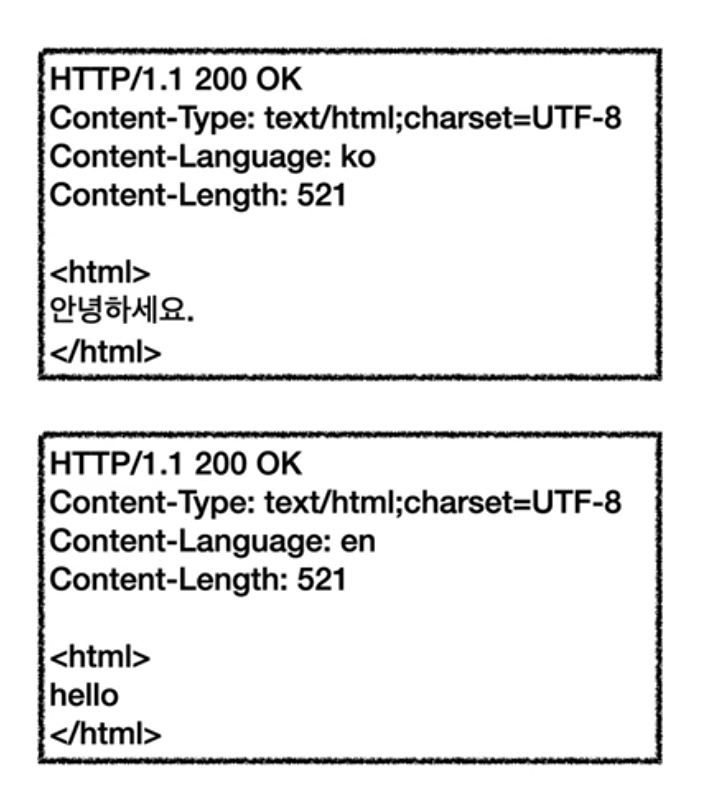

# HTTP 헤더 1

## 일반 헤더
 - header-field = field-name ":" OWS field-value OWS (OWS:띄어쓰기 허용)
 - 용도
   - HTTP 전송에 필요한 모든 부가 정보
 - 표준 헤더가 너무 많음
   - https://en.wikipedia.org/wiki/List_of_HTTP_header_fields
 - 필요시 임의의 헤더 추가 가능
   - 예) helloworld: hihi
 - 예시
   - 메시지 바디의 내용
   - 메시지 바디의 크기, 압축, 인증
   - 요청 클라이언트
   - 서버 정보
   - 캐시 관리 정보
   - etc... 무수히 많음
 - 헤더 예시 1
    ```
        GET /search?q=hello&hl=ko HTTP/1.1
        Host: www.google.com
    ```
     - field-name은 대소문자 구분 없음
 - 헤더 예시 2
    ```
        HTTP/1.1 200 OK
        Content-Type: text/html;charset=UTF-8
        Content-Length:3423

        <html>
            <body>...</body>
        </html>
    ```

## HTTP 헤더 분류 - RFC2616(과거)
 - 
 - 헤더 분류
  1. General 헤더
    - 메시지 전체(요청, 응답 구분 없이)에 적용되는 정보
    - 예) Connection: close
  3. Request 헤더
    - 요청 정보
    - 예) User-Agent: Mozilla/5.0 (Macintosh; ..)
  4. Response 헤더
    - 응답 정보
    - 예) Server: Apache
  5. Entity 헤더
    - 엔티티 바디 정보
    - 예
      - Content-Type: text/html
      - Content-Length: 3423

## HTTP BODY - message body - RFC2616(과거)
 - 
 - 메시지 본문(message body)은 엔티티 본문(entity body)을 전달하는 데 사용
 - 엔티티 본문은 요청이나 응답에서 전달할 실제 데이터
 - 엔티티 헤더는 엔티티 본문의 데이터를 해석할 수 있는 정보 제공
   -  종류
        1. 데이터 유형(html, json)
        2. 데이터 길이
        3. 압축 정보 
        4. 등등

## HTTP 표준 - 1999년 RFC2616 폐기됨
 - 스펙 세분화 됨
## HTTP 표준 - 2014년 RFC7230~7235 등장

## RFC723x 변화
 - 엔티티(Entity) -> 표현 (Representation)
 - Representation = representation Metadata + Representation Data
    > 표현 = 표현 메타데이터 + 표현 데이터

## HTTP BODY - message body - RFC7230(최신)
 - 
 - 메시지 본문(message body)를 통해 표현 데이터 전달
 - 메시지 본문 = 페이로드(payload)
 - **표현**은 요청이나 응답에서 전달할 실제 데이터
 - **표현 헤더는 표현 데이터**를 해석할 수 있는 정보 제공
   > 데이터 유형(html,json), 데이터 길이, 압축 정보 등등
 - 참고
   - 표현 헤더는 표현 메타데이터와, 페이로드 메시지를 구분해야만 하지만 생략함.  

## 왜 Entity에서 표현으로 변경되었을까?
 - 리소스를 HTML 또는 json으로 표현으로 명확하게 구체화 

## 표현 헤더
 -  
 -  사용 범위
    1. 전송
    2. 응답
 -  종류
    1. Content-Type
      - 
      - 표현 데이터의 형식
        > 미디어 타입, 문자 인코딩 
      - 종류
        1. text/html; charset=utf-8
        2. appliation/json
        3. image/png 
    2. Content-Encoding
      - 
      - 표현 데이터를 압축하기 위해 사용
      - 데이터를 전달하는 곳에서 압축 후 인코딩 헤더 추가
      - 데이터를 읽는 쪽에서 인코딩 헤더의 정보로 압축 해제
      - 종류
        1. gzip
        2. deflate
        3. identity : 압축 안함
    3. Content-Language
      - 
      - 표현 데이터의 자연 언어
      - 큰 공식 사이트의 경우 다국어 지원 시 클라이언트에서 원하는 언어 요청 가능
      - 예) 한국어, 영어 등
    1. Content-Length
       - 
       - 바이트 단위
       - 표현 데이터의 길이
       - Transfer-Encoding(전송 코딩)을 사용하면 Content-Length를 사용하면 안됨
         - Transfer-Encoding에 content-Length 관련 정보 포함함, 추후 자세히 설명
       - *명확히는 표현 헤더가 아닌 페이로드 헤더이다*

## 협상(콘텐츠 네고시에이션)
 - 클라이언트가 선호하는 표현 요청
 - 서버는 클라이언트가 원하는 우선순위에 최대한 맞춰서 표현 제공
 - 사용 범위
   - 요청 시
 - 종류
    1. Accept
        - 클라이언트가 선호하는(가능하다면) 미디어 타입 전달
    2. Aceept-Charset
        - 클라이언트가 선호하는(가능하다면) 문자 인코딩
    3. Accept-Encoding
        - 클라이언트가 선호하는(가능하다면) 압축 인코딩
    4. Accept-Language
        - 클라이언트가 선호하는(가능하다면) 자연 언어
        - 
        - 
        - 
        - 
          - *협상과 우선순위1 - Quality Values(q) 섹션 참고*

## 협상과 우선순위1 - Quality Values(q)
  - 
  - Quality Values(q) 값 사용
  - 0~1, 클수록 높은 우선순위
  - 생략 시 1
  - Accept-Language: ko-KR;ko;q=0.9,en-US;q=0.8;en;q=0.7
    - 해석
      1. ko-KR;q=1 (q생략)
      2. ko;q=0.9
      3. en-US;q=0.8
      4. en:q=0.7

## 협상과 우선순위2 - Quality Values(q)
 - 
 - 구체적인 것이 우선한다.
 - 예) `Accept:text/*, text/plain, text/plain;format=flowed,*/*`
    1. text/plain;format=flowed
    2. text/plain
    3. text/*
    4. */*

## 협상과 우선순위3 - Quality Values(q)
 - 구체적인 것을 기준으로 미디어 타입을 맞춘다.
 - 예) `Accept:text/*;q=0.3,text/html;q=0.7,text/html;level=1,text/html;level=2;q=0.4,*/*,q=0.5`
   - 

## 참고
 - https://www.inflearn.com/course/http-%EC%9B%B9-%EB%84%A4%ED%8A%B8%EC%9B%8C%ED%81%AC/lecture/61375?tab=note&volume=0.10&quality=auto 인프런 - 모든 개발자를 위한 HTTP 기본 지식