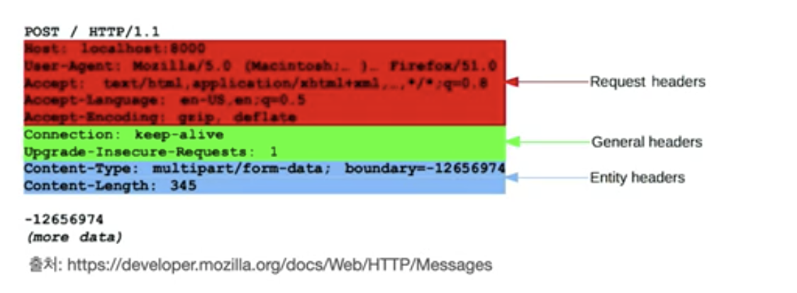

# HTTP 헤더 1

## 일반 헤더
 - header-field = field-name ":" OWS field-value OWS (OWS:띄어쓰기 허용)
 - 용도
   - HTTP 전송에 필요한 모든 부가 정보
 - 표준 헤더가 너무 많음
   - https://en.wikipedia.org/wiki/List_of_HTTP_header_fields
 - 필요시 임의의 헤더 추가 가능
   - 예) helloworld: hihi
 - 예시
   - 메시지 바디의 내용
   - 메시지 바디의 크기, 압축, 인증
   - 요청 클라이언트
   - 서버 정보
   - 캐시 관리 정보
   - etc... 무수히 많음
 - 헤더 예시 1
    ```
        GET /search?q=hello&hl=ko HTTP/1.1
        Host: www.google.com
    ```
     - field-name은 대소문자 구분 없음
 - 헤더 예시 2
    ```
        HTTP/1.1 200 OK
        Content-Type: text/html;charset=UTF-8
        Content-Length:3423

        <html>
            <body>...</body>
        </html>
    ```

## HTTP 헤더 분류 - RFC2616(과거)
 - 
 - 헤더 분류
  1. General 헤더
    - 메시지 전체(요청, 응답 구분 없이)에 적용되는 정보
    - 예) Connection: close
  3. Request 헤더
    - 요청 정보
    - 예) User-Agent: Mozilla/5.0 (Macintosh; ..)
  4. Response 헤더
    - 응답 정보
    - 예) Server: Apache
  5. Entity 헤더
    - 엔티티 바디 정보
    - 예
      - Content-Type: text/html
      - Content-Length: 3423

## HTTP BODY - message body - RFC2616(과거)
 - 
 - 메시지 본문(message body)은 엔티티 본문(entity body)을 전달하는 데 사용
 - 엔티티 본문은 요청이나 응답에서 전달할 실제 데이터
 - 엔티티 헤더는 엔티티 본문의 데이터를 해석할 수 있는 정보 제공
   -  종류
        1. 데이터 유형(html, json)
        2. 데이터 길이
        3. 압축 정보 
        4. 등등

## HTTP 표준 - 1999년 RFC2616 폐기됨
 - 스펙 세분화 됨
## HTTP 표준 - 2014년 RFC7230~7235 등장

## RFC723x 변화
 - 엔티티(Entity) -> 표현 (Representation)
 - Representation = representation Metadata + Representation Data
    > 표현 = 표현 메타데이터 + 표현 데이터

## HTTP BODY - message body - RFC7230(최신)
 - 
 - 메시지 본문(message body)를 통해 표현 데이터 전달
 - 메시지 본문 = 페이로드(payload)
 - **표현**은 요청이나 응답에서 전달할 실제 데이터
 - **표현 헤더는 표현 데이터**를 해석할 수 있는 정보 제공
   > 데이터 유형(html,json), 데이터 길이, 압축 정보 등등
 - 참고
   - 표현 헤더는 표현 메타데이터와, 페이로드 메시지를 구분해야만 하지만 생략함.  

## 왜 Entity에서 표현으로 변경되었을까?
 - 리소스를 HTML 또는 json으로 표현으로 명확하게 구체화 

