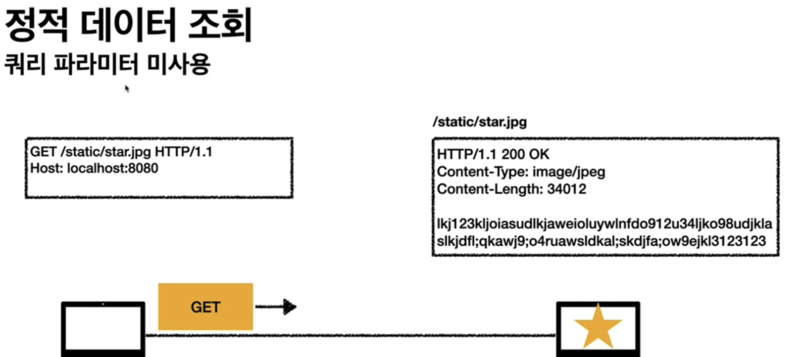
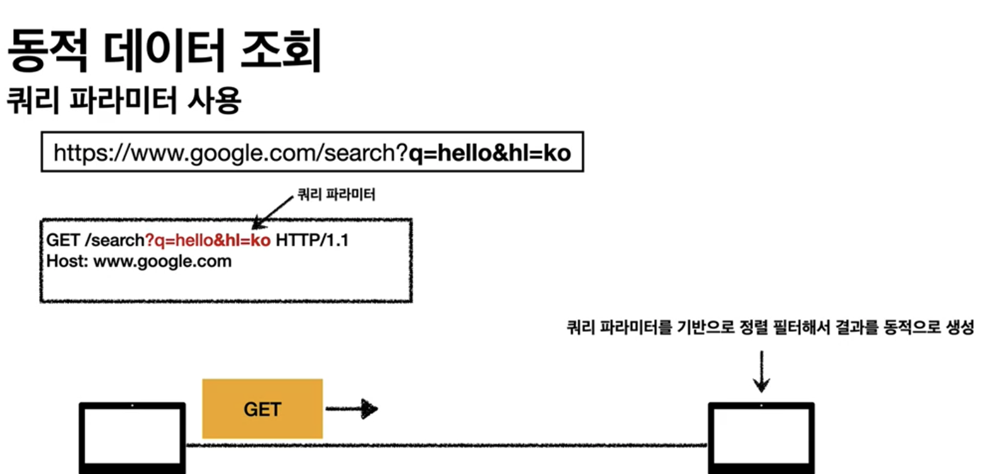
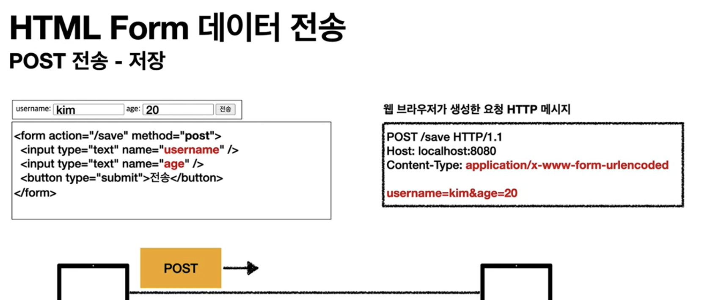
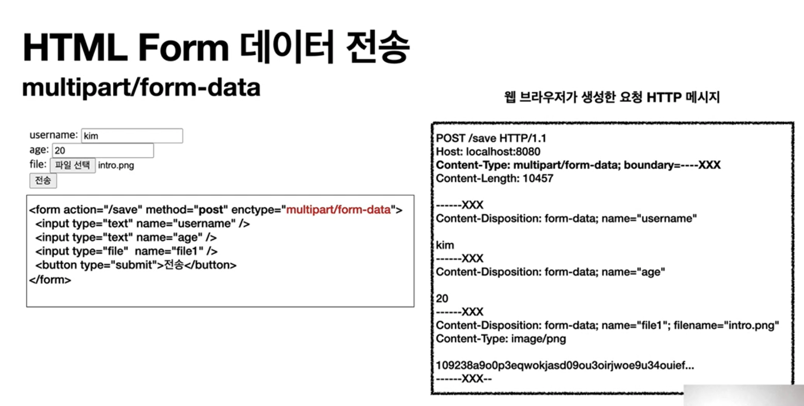
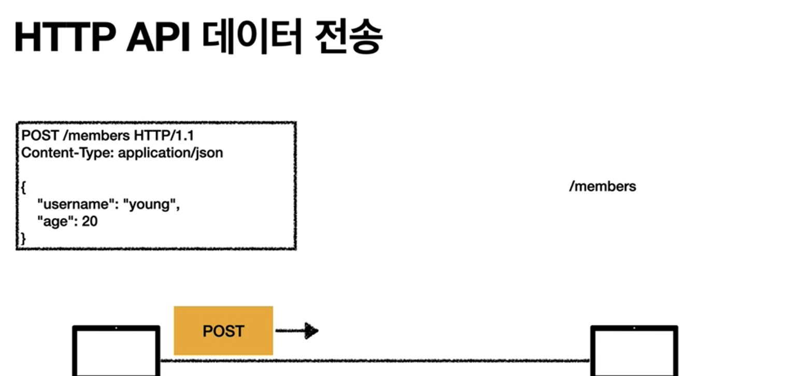

# http Method 활용
 - 클라이언트에서 서버로 데이터 전송
 - HTTP API 설계 예시
  
## 클라이언트에서 서버로 데이터 전송
 - 데이터 전달 방식은 크게 2가지
   1. **쿼리 파라미터를 통한 데이터 전송**
      - GET
      - 예시
        - 정렬
        - 필터(검색어)
   2. **Message Body를 통한 데이터 전송**
      - POST, PUT, PATCH
      - 예시
        - 회원 가입
        - 상품 주문
        - 리소스 등록
        - 리소스 변경

## Four cases
 1. 정적 데이터 조회
      - 쿼리 파라미터 없이 리소스 경로를 통한 단순 조회 가능
          - 
          - 조회 시 GET 사용
          - 이미지, 정적 테스트 문서
  1. 동적 데이터 조회
      - 쿼리 파라미터 사용
          - 
              - 조회 시 GET 사용
              - 주로 검색, 게시판 목록에 대한 정렬, 필터(검색어)
              - 조회 조건을 줄여주는 필터, 조회 결과를 정렬하는 정렬 조건에 주로 사용

  2. HTML Form을 통한 데이터 전송
      - GET, POST만 지원
      -  
          - SUBMIT 클릭 시 웹 브라우저가 POST 메시지를 생성
          - application/x-www-form-urlencoded 의미 : 한글 쿼리 파라미터에 대해서 브라우저가 인코딩해서 넘김
      
      - 
        - Method를 GET으로 바꾸기 가능
          - 브라우저가 GET으로 바꿔준다. (반드시 조회시에서만 사용)
      - 
        - 파일 전송 시 
        - content-Type: multipart/form-data; boundary=---XXX 
          - 웹 브라우저가 body를 자동으로 경계(boundary) 단위로 잘라줌
          - 바이너리 데이터 전송시 사용
          - 여러 종류의 여러 파일과 폼의 내용을 함께 전송 가능(multipart인 이유)
      - 예시
          - 회원 가성
          - 상품 주문
          - 데이터 변경
  3. HTTP API를 통한 데이터 전송
      - 
      - POST, PUT, PATCH: 메시지 바디를 통해 데이터 전송
      - GET: 조회, 쿼리 파라미터 지향
      - Content-Type: application/json
         - JSON 사용 (사실상 표준)
           - JSON 단점은?
           - XML과 트레이드 오프는?
      - 예시
        - 회원가입, 상품 주문, 데이터 변경
        - 서버 to 서버
            - 백엔드 시스템 통신
        - 앱 클라이언트
        - 웹 클라이언트(Ajax)
