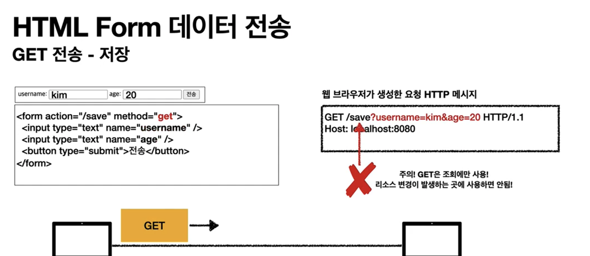

# http Method 활용
 - 클라이언트에서 서버로 데이터 전송
 - HTTP API 설계 예시
  
## 클라이언트에서 서버로 데이터 전송
 - 데이터 전달 방식은 크게 2가지
   1. **쿼리 파라미터를 통한 데이터 전송**
      - GET
      - 예시
        - 정렬
        - 필터(검색어)
   2. **Message Body를 통한 데이터 전송**
      - POST, PUT, PATCH
      - 예시
        - 회원 가입
        - 상품 주문
        - 리소스 등록
        - 리소스 변경

## Four cases
 1. 정적 데이터 조회
      - 쿼리 파라미터 없이 리소스 경로를 통한 단순 조회 가능
          - 
          - 조회 시 GET 사용
          - 이미지, 정적 테스트 문서
  1. 동적 데이터 조회
      - 쿼리 파라미터 사용
          - 
              - 조회 시 GET 사용
              - 주로 검색, 게시판 목록에 대한 정렬, 필터(검색어)
              - 조회 조건을 줄여주는 필터, 조회 결과를 정렬하는 정렬 조건에 주로 사용

  2. HTML Form을 통한 데이터 전송
      - GET, POST만 지원
      -  
          - SUBMIT 클릭 시 웹 브라우저가 POST 메시지를 생성
          - application/x-www-form-urlencoded 의미 : 한글 쿼리 파라미터에 대해서 브라우저가 인코딩해서 넘김
      
      - 
        - Method를 GET으로 바꾸기 가능
          - 브라우저가 GET으로 바꿔준다. (반드시 조회시에서만 사용)
      - 
        - 파일 전송 시 
        - content-Type: multipart/form-data; boundary=---XXX 
          - 웹 브라우저가 body를 자동으로 경계(boundary) 단위로 잘라줌
          - 바이너리 데이터 전송시 사용
          - 여러 종류의 여러 파일과 폼의 내용을 함께 전송 가능(multipart인 이유)
      - 예시
          - 회원 가성
          - 상품 주문
          - 데이터 변경
  3. HTTP API를 통한 데이터 전송
      - t
      - POST, PUT, PATCH: 메시지 바디를 통해 데이터 전송
      - GET: 조회, 쿼리 파라미터 지향
      - Content-Type: application/json
         - JSON 사용 (사실상 표준)
           - JSON 단점은?
           - XML과 트레이드 오프는?
      - 예시
        - 회원가입, 상품 주문, 데이터 변경
        - 서버 to 서버
            - 백엔드 시스템 통신
        - 앱 클라이언트
        - 웹 클라이언트(Ajax)

## HTTP API 설계 예시
 1. HTTP API - 컬렉션
    - POST 기반 등록
    - 예) 회원 관리 API 제공
 2. HTTP API - 스토어
    - PUT 기반 등록
    - 예) 정적 컨텐츠 관리, 원격 파일 관리
 3. HTML FORM 사용
    - 웹 페이지 회원 관리
    - GET, POST만 지원

# 회원 관리 시스템
## POST - 신규 자원 등록 특징
 1. 클라이언트는 등록 예정 리소스의 URI를 사전에 알 수 없음
    - 회원 등록 /members -> POST
    - POST /members
 2. 서버가 새로 등록된 리소스 URI를 생성해준다.
    - HTTP/1.1 201 Created
    - Location: /members/100
 3. 컬랙션(Collection)
    1. 서버가 관리하는 리소스 디렉토리
    2. 서버가 리소스의 URI를 생성하고 관리
    3. 예시 /members
## API URI 설계
 1. **회원** 목록 조회
      - GET /members
 2. **회원** 조회
      - GET /members/{id}
 3. **회원** 등록
      - POST /members/{id}
 4. **회원** 수정 -> PATCH, PUT, POST
      - PATCH /members/{id}
 5. **회원** 삭제
      - DELETE /members/{id}
- 참고
   - 계층 구조상 상위를 컬렉션으로 가정하고 복수단어 사용 권한
   - 예시
       - member -> members

# 파일 관리 시스템
- API 설계 - PUT 기반 등록

## PUT - 신규 자원 등록 특징
 1. 클라이언트가 리소스 URI를 사전에 알고 있어야 한다.
   - 파일 등록 /files/{filename} -> PUT
   - PUT /files/star.jpg
 2. 클라이언트가 직접 리소스의 URI를 지정한다.
 3. 스토어 (Store)
   - 클라이언트가 관리하는 리소스 저장소
   - (사전에) 클라이언트가 리소스의 URI를 알고 관리
   - 여기서 스토어는 /files 
## API URI 설계
1. **파일** 목록
    - GET /files
2. **파일** 조회
    - GET /fiels/{filename}
3. **파일** 등록
    - PUT /files/{filename}
    - why PUT?
        - (URI가) 존재하지 않는 경우 생성
        - (URI가) 존재하는 경우 덮어쓰기
4. **파일** 삭제
    - DELETE /files/{filename}
5. **파일** 대량 등록
    - POST /files
    - 임의로 등록 가능

# HTML FORM 사용
  - Control URI 사용
    - (제약) 순수 HTML FORM 
    - GET, POST만 지원
    - 제약을 해결하기 위해 동사로 된 리소스 경로 사용
    - POST의 /new, /edit, /delete가 컨트롤 URI
    - (Control URI을 남용 하지 말 것) HTTP 메서드로 해결하기 애매한 경우 사용(HTTP API 포함)
  - 만약 AJAX 같은 기술을 사용 시 모든 HTTP Method 사용 가능
## API URI 설계
1. **회원** 목록 조회
   - GET /members
2. **회원** 조회
   - GET /members/{id}
3. **회원** 등록 *폼* (html form 출력, 회원정보 입력 가능)
   - GET /members/new
4. **회원** 등록 (form submit 시)
   - POST /members
   - 또는 POST /members/new 
     - 추천 (1:1 매칭)
       -  서버에서 validation check 실패시 POST 최종 결과를 회원 정보 Form으로 redirect 처리 시 URI 경로자체가 이동하므로 이전 폼으로 되돌아가기에 편함)
5. **회원** 수정 *폼*
   - GET /members/{id}/edit
6. **회원** 수정 -> PATCH, PUT, POST
   - POST /members/{id}
   - 또는 POST /members/{id}
7. **회원** 삭제
   - POST /members/{id}/delete (control URI 사용)

# 좋은 URI 설계 개념 practice (not answer)
 - 문서 document
     - 단일 개념(파일 하나, 객체 인스턴스, 데이터베이스 row)
     - 예
         - /members/100
         - /files/star.jpg
 - 컬렉션 collection 
     - 서버가 관리하는 리소스 디렉토리
     - 서버가 리소스의 URI를 생성하고 관리
     - 예) /members
 - 스토어 store
     - 클라이언트가 관리하는 자원 리소스
     - 클라이언트가 리소스의 URI를 사전에 알고 관리
     - 예) /files
 - 컨트롤러(controller), control URI
     - 문서, 컬렉션, 스토어로 해결하기 어려운 추가 프로세스 실행
     - 동사를 직접 사용
     - 예
       -  /shop/{id}/start-delivery
 - 참고
     - https://restfulapi.net/resource-naming

## 참고 
 - https://www.inflearn.com/course/http-%EC%9B%B9-%EB%84%A4%ED%8A%B8%EC%9B%8C%ED%81%AC/lecture/61369?tab=note&volume=0.10&quality=auto