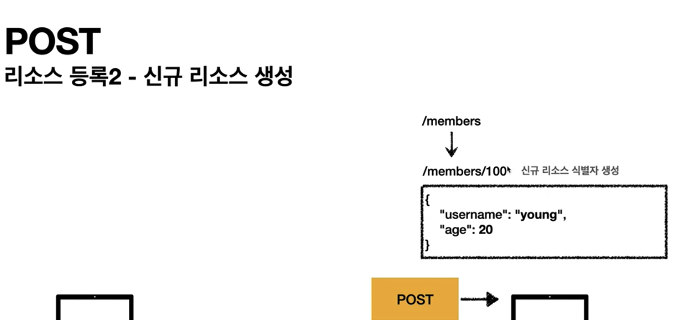
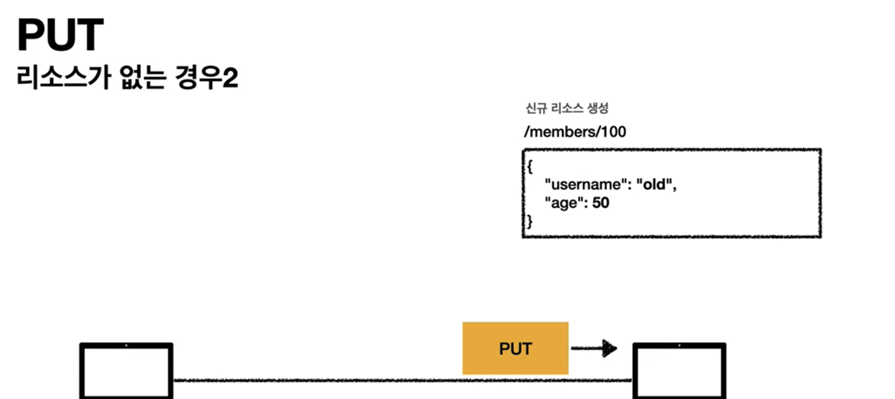
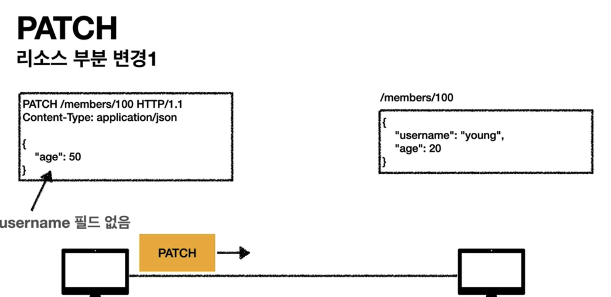

# HTTP Method
 - HTTP API를 만들어보자
## 요구사항
 - 회원 정보 관리 API를 만들자
 - API 목록
    1. 회원 목록 조회
    2. 회원 조회
    3. 회원 등록
    4. 회원 수정
    5. 회원 삭제

## API URI 설계 (Uniform Resource Identifier) - 안좋은 예시
 1. 회원 목록 조회
    - /read-member-list
 2. 회원 조회
    - /read-member-by-id
 3. 회원 등록
    - /create-member
 4. 회원 수정
    - /update-member
 5. 회원 삭제
    - /delete-member

## API URI 고민
 - URI는 리소스만 식별
 - 리소스
     - 리소스가 아닌 예시
         - 회원을 등록 (행위)
         - 회원을 수정 (행위)
     - 리소스 예시
         - 회원
 - 리소스 식별 방법
     - 행위(등록,수정,삭제 등)는 리소스가 아니다(배제 필요)
     - 리소스는 회원
     - 회원 리소스를 URI에 매핑
 - 리소스와 해당 리소스를 대상으로 하는 행위를 분리
     - 리소스 : 회원
     - 행위: 조회, 등록, 삭제, 변경
 - 주석
     -  리소스는 명사
     -  행위는 동사

## HTTP Method 종류 - 주요
 1. GET :리소스 조회
 2. POST : 요청 데이터 처리, 주로 등록에 사용
 3. PUT : 리소스를 대체, 해당 리소스가 없으면 생성
 4. PATCH: 리소스 부분 변경
 5. DELETE: 리소스 삭제

## HTTP Method 종류 - 기타
 1. HEAD : GET에서 메시지 부분을 제외하고, 상태 줄과 헤더만 반환
 2. OPTIONS: 대상 리소스에 대한 통신 가능 옵션(Method)을 설명 (주로 CORS에서 사용)
 3. CONNECT: 대상 자원으로 식별되는 서버에 대한 터널을 설정
 4. TRACE: 대상 리소스에 대한 경로를 따라 메시지 루프백 테스트를 수행

## GET - 상세
  
  ```
    GET /search?q=hello&hl=ko HTTP/1.1
    Host: www.google.com
  ```
  1. 리소스 조회
  2. 데이터는 주로 query(쿼리 파라미터 (쿼리 스트링))을 통해 전달
  3. 메시지 바디에 데이터 포함하는 방식은 지양
    - 최신 스펙에서는 허용하나,
    - 지원하지 않는 서버가 많음

## POST - 상세
  1. 스펙
       - 대상 리소스가 리소스의 고유한 의미 체계에 따라 요청에 포함된 표현을 처리하도록 요청한다
       - 
          - 메시지 바디를 통해 서버로 요청 데이터 전달
          - HTTP 예시
               - ```
                   POST /members HTTP/1.1
                   Content-Type: application/json

                   {
                       username:hello
                       age:20
                   }
                 ```
       - 
            - 서버는 요청 데이터 처리
            - 메시지 바디의 데이터를 처리하는 모든 기능 수행
       - 
            - 주로 전달된 데이터는 신규 리소스 등록, 프로세스 처리 시 사용
 2. 새 리소스 생성
    1. 서버가 아직 식별하지 않은 새 리소스 생성
         - 예
             - (사용자 관점) 신규 주문 생성
             - (사용자 관점) 게시판, 뉴스 그룹, 메일링 리스트, 블로그 또는 유사한 기사 그룹에 메시지 게시
                - 게시판 글쓰기
                - 댓글 달기
             - (브라우저 관점)HTML 양식에 입력 된 필드와 같은 데이터 블록을 데이터 처리 프로세스에게 제공
                 - HTML FORM에 입력한 정보로 회원가입, 주문 등에서 사용
    2. 기존 자원에 새 데이터 추가
         - 예
             - 한 문서 끝에 새로운 내용 추가
 3. 요청 데이터 처리
       - 데이터 생성 또는 변경이 아닌, 프로세스를 처리하는 경우 (POST 결과에 의해 새 리소스가 생성되지 않을 수 있음) 
          - 예
              - (사용자 관점) 주문 결제 완료 -> 배달 시작 -> 배달 완료 (단순히 값 변경을 넘어 프로세스의 상태가 변경되는 경우)
              - (인터페이스 관점) POST /orders/{orderId}/start-delivery (컨트롤 URL : 리소스로 처리가 안되는 경우에만 허용) 
 4. 다른 메서드로 처리하기 애매한 경우 (모든 행위 가능)
    - 단점
      -  GET cache 불가
    - 예시
        - JSON으로 조회 데이터를 넘겨야 하는 경우, GET 메서드를 사용하기 어려운 경우   
 5. 결론
    - 해당 리소스 URI에 대한 POST 요청을 수신한 *서버*는 요청 데이터를 어떻게 처리할 것인지에 대해서 리소스마다 별도 처리 필요
 6. 주석
    - https://tools.ietf.org/html/rfc7231#section-4.3.3

## PUT
 - ```
    PUT /members/100 HTTP/1.1
    Content-Type: application/json

    {
        "username": "hello",
        "age": 20
    }
   ```
 - 리소스를 (덮어쓰기 형식의) 대체
    1. 리소스가 있으면 대체 (덮어쓰기)
        - 
        - 
        - 
            - 100번 회원의 age만 변경하려는 경우 (잘못된 접근 방식)
        - 
            - username 필드가 삭제됨 (의도치 않은 결과)
            - 결론
                - PUT은 기존 리소스의 특정 값만 변경하는 게 아닌, 새 요청의 data 값으로 완벽하게 교체함
    2. 리소스가 없으면 생성
        - 
        - 
 - 클라이언트가 리소스를 식별한 상태에서 사용
    1. 클라이언트가 리소스 위치를 URI에 명시
    2. POST와 차이점


## PATCH
 - 리소스 부분 변경
    -  
    -  
 - PATCH 비지원 서버인 경우는 POST로 대체

## DELETE
 - 리소스 제거
 - (인터페이스 관점)
    - ```
        DELETE /members/100 HTTP/1.1
        Host:localhost:8080
      ```

## 
## API URI 설계 - 완료
 1. **회원** 목록 조회
      - /members
 2. **회원** 조회
      - /members/{id}
 3. **회원** 등록
      - /members/{id}
 4. **회원** 수정
      - /members/{id}
 5. **회원** 삭제
      - /members/{id}
     - 참고
       - 계층 구조상 상위를 컬렉션으로 가정하고 복수단어 사용 권한
       - 예시
           - member -> members

## 참고
 - https://www.inflearn.com/course/http-%EC%9B%B9-%EB%84%A4%ED%8A%B8%EC%9B%8C%ED%81%AC/lecture/61364?tab=note&volume=0.20&quality=auto

# 추가 참고 예정
 - 책 : 웹 API 디자인