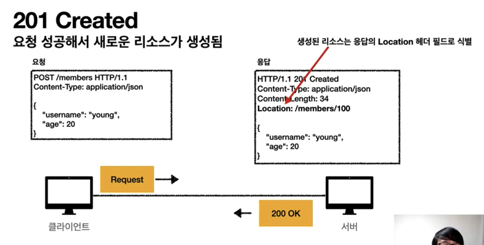

# http status code

## 상태 코드
 - 클라이언트의 요청에 대한 처리 상태를 표시
 - 1xx (Informational)
   - 요청이 수신되어 처리 중
   - 거의 사용 안함
 - 2xx (Successful)
 - 3xx (Redirection)
   - 요청을 완료하려면 추가 행동이 필요
 - 4xx (Client Error)
   - 잘못된 문법 등으로 서버가 요청을 수행할 수 없음
 - 5xx (Server Error)
   - 정상 요청을 처리하지 못함

## 만약 모르는 상태 코드가 나타나면?
 - 클라이언트가 인식할 수 없는 상태코드를 서버가 반환시
   - 클라이언트는 상위 상태코드로 해석해서 처리
   - 클라이언트가 모르는 상태 코드에 대해서 클라이언트는 상태 코드에 대해서 주요 의미에 대해서 처리가 가능
     - 예
       1. 299 ??? -> 2xx (Successful)
       2. 451 ??? -> 4xx (Client Error)
       3. 599 ??? -> 5xx (Server Error)

## 1xx (Informational)
 - 요청이 수신되어 처리 중
 - 거의 사용하지 않음
 - 생략

## 2xx (Successful)
 - 클라이언트의 요청을 성공적으로 처리
 - 종류
  1. **200 OK**
       - 
  2. **201 Created**
       - 
            - 클라이언트가 새 리소스 생성 요청
            - 서버의 응답
                - 신규 리소스의 URI를 Location으로 표기
  3. **202 Accepted**
       - 요청이 접수되었으나 처리가 완료되지 않았음
           - 예시
               - 배치 처리에 대해서, 요청 접수 후 1시간 뒤에 배치 프로세스가 요청을 처리함
  4. **204 No Content**
       - 서버가 요청을 성공적으로 수행했지만, 응답 페이로드 본문에 보낼 데이터가 없음
       - 결과 내용이 없어도 204 메시지(2xx)만으로 요청에 대한 성공 여부 파악 가능
           - 예
               1. 웹 문서(구글 docs)의 save 버튼
                    - save 버튼의 결과로 아무 내용이 없어도 된다
                    - save 버튼을 눌러도 같은 화면을 유지해야 한다
      - 그 외 많은 상태코드가 존재
          - 최소한 범위만 사용 지향
              - 200, 201 등 필수 상태 코드만 사용해서 클라이언트에서 상태코드에 대한 처리 비용 최소화 추천

## 3xx (Redirection)
  -  
  - 요청을 완료하기 위해 유저 에이전트의 추가 조치 필요
    > 유저 에이전트: 클라이언트 프로그램. 웹 브라우저, 안드로이드 앱 등
  - 웹 브라우저는 3xx 응답의 결과에 Location 헤더가 존재 시, Location 위치로 자동 이동(리다이렉트)
  - 사용 예시
    - 페이지 리소스에 대한 URI 변경에 의해 기존 URL에 접근 시 (북마크, 공유된 기존 링크 등)에 대한 리다이렉트 처리 
  - 종류
    1. 영구 리다이렉션
         - 리소스의 URI가 영구적으로 이동
         - 원래의 URL을 사용하지 않음
         - 검색 엔진 등에서도 변경 인지
         - 종류
           - **301 Moved Permanently**
             -  
             - 리다이렉트시 요청 메서드가 (이전 요청 Method가 GET이 아닌 경우) GET Method로 변하고, 본문이 제거될 수 있음(MAY)
               > MAY 의미는 처음 스펙은 달랐지만, 이후 브라우저에서 해당 사항대로 구현해서 스펙을 변경함.
               > GET인 이유는 페이지 요청이기 때문이다. 
             - 결론
               - 301 대응으로 308 등장
           - **308 Permanent Redirect**
             -  
             - 301과 기능은 같음
             - 리다이렉트시 요청 메서드와 본문 유지(처음 POST Method로 보내면 리다이렉트 POST Method로 보낸다)
             - 주의, 실무에서는 301처리 지향. 이유는 URI가 바뀌면 request body 내용도 바뀔 확률이 높다.
         - 예
           1. /members -> /users 
           2. /event -> /new-event
    2. 일시 리다이렉션
        - 리소스의 URI가 일시적으로 변경
        - 따라서 검색 엔진 등에서 URL를 변경하면 안됨 
        
        - 실무에서 많이 쓰임
        - 종류
          1. **302 Found**
               - 리다이렉트시 요청 메서드가 (이전 요청 Method가 GET이 아닌 경우) GET Method로 변하고, 본문이 제거될 수 있음(MAY)
                  > MAY 의미는 처음 스펙 의도는 HTTP 메서드를 유지하는 것을 의도했으나 스펙이 명확하지 않음(자연어로 작성에 대한 한계?)에 의해서 대부분 브라우저에서 구현 시 위 GET Method로 변경되게 구현됨. -> 결과적으로 스펙이 변경됨.
                  과거 버전 브라우저에 대한 GET Method 변경 여부에 대한 확실성 보장은 없다.
                  GET인 이유는 페이지 요청이기 때문이다. 
               - 결론
                 - GET으로 변할 수 있음 (행위에 대한 모호한 결과 반환)
                 - 현실적으로 302 많이 쓰이는 중
                 - 자동 리디렉션시에 GET으로 변해도 된다면, 그냥 302 사용해도 큰 문제는 없음
                 - 모호한 302보다 303 또는 307 지향
          2. **307 Temporary Redirect**
               - 302와 기능은 같음
               - 리다이렉트시 요청 메서드와 본문 유지(요청 메서드를 변경하면 안된다. MUST NOT) 
               - 결론
                   - 메서드가 변하면 안됨
          3. **303 See Other**
            - 302와 기능은 같음
            - 리다이렉트시 요청 메서드가 GET으로 변경(명확) 
          - PRG 패턴 : Post/Redirect/Get
            - POST로 주문후에 새로 고침으로 인한 중복 주문 방지
              > 클라이언트 차원에서 블록 처리, 그 외 별도로 서버 차원에서 블록 처리 필요
            - POST로 주문후에 주문 결과 화면을 GET 메서드로 리다이렉트
            - 새로고침해도 결과 화면을 GET으로 조회
            - 중복 주문 대신에 결과 화면만 GET으로 다시 요청
            - PRG 처리 이전
               - 
                  - POST로 주문(또는 결제 등 1회성 처리가 필요한 경우, form submit button 클릭) 후 (처리에 대한 결과를 기다리는 중에) 웹 브라우저를 새로고침 시 중복 주문이 될 확률이 있다. (새로 고침은 마지막 요청을 다시 진행)
                    > 최신 브라우저는 새로고침 시 POST가 되기 전에 경고창을 먼저 띄우는 경우도 있다. 
                    > 서버에서 별도 예외처리도 필요. 예시로 1번만 POST 처리
                  - 결론
                    - GET으로 변경
                  - 의문
                      - form을 통한 POST 처리 후 새로 고침 시 정말로 이전 form 필드 값을 사용한 POST 요청을 다시 할까? 즉 브라우저 새로고침이 정말로 마지막 요청을 다시 진행하는 게 사실?
                        - 답: 사실이다.
            - PRG 처리
                - 
                - PRG 이후 리다이렉트
                    - URL이 이미 POST -> GET으로 리다이렉트 됨
                    - 새로 고침 해도 GET으로 결과 화면만 조회
                - 의문
                  - POST 후 응답(PRG 처리) 되기 전에 새로 고침한 경우 어떻게 예방 가능? (인프런에 질문 올림)   
    3. 특수 리다이렉션
        - 결과 대신 캐시를 사용
        - 예
             - 클라이언트에서 캐시 기간이 만료로 판단한 경우, 클라이언트가 캐시 관련 정보(생성 일자 등)를 통해 캐시 유효 여부를 서버에게 요청 후 서버의 응답에 따라 리다이랙션 처리
  - 기타 status 코드 종류
    - **300 Multiple Choises**
      - 거의 안씀
    - **304 Not Modified**
      - 캐시를 목적으로 사용
      - 클라이언트에게 리소스가 수정되지 않았음을 알려준다. 따라서 클라이언트는 로컬에 저장된 캐시를 재사용한다.
        > 캐시로 리다이렉트 한다.
      - 304 응답은 응답에 메시디 바디를 포함하면 안된다.
        > 로컬 캐시를 목적, 그외 목적은 허용되지 않음
      - 조건부 GET, HEAD 요청시 사용
      - 주석
        - 별도 http-cache.md 문서 참고 

## 4xx (Client Error)
 - 클라이언트의 요청에 잘못된 문법등으로 서버가 요청을 수행할 수 없음
 > 오류의 원인이 클라이언트에 있음
 - **클라이언트가 이미 잘못된 요청, 데이터를 보내고 있기 때문에, 똑같은 재시도가 실패함**
 - 종류
   -  400 Bad Request
      -  클라이언트가 잘못된 요청을 해서 서버가 요청을 처리할 수 없음
      - 원인
          - 요청 구문, 메시지 등등 오류
          - 예
              - 요청 파라미터가 잘못된 경우
              -  API 스펙이 맞지 않은 경우
      - 주석
          - server에서 철저히 막아줘야 함
      - 해결
          - 클라이언트는 요청 내용을 다시 검토하고, 보내야함

## 401 Unauthorized
 - 클라이언트가 해당 리소스에 대한 인증이 필요함
 - 인증(Authentication) 되지 않음
 - 401 오류 발생 시 응답에 WWW-Authenticate 헤더와 함께 인증 방법을 설명
 - 참고
    1. 인증(Authentication): 본인이 누구인지 확인, 예시) 로그인
    2. 인가(Authorization): 권한부여
        > 특정 리소스에 접근할 수 있는 권한, 인증 후 인가가 존재
    3. 오류 메시지가 Unauthorized의 의미가 인증이 아닌 인가를 명시하는 느낌을 줌
        > Unauthorized말고  Unauthentication이 더 좋은 네이밍
## 403 Forbidden
 - 서버가 요청을 이해했지만 승인을 거부함
 - 예시
   - 주로 인증 자격 증명은 있지만, 접근 권한이 불충분한 경우
   - 예
     - 어드민 등급이 아닌 사용자가 로그인 시, 어드민 등급의 리소스에 접근하는 경우
     - 그 외 추가 필요

## 404 Not Found
 - 요청 리소스를 찾을 수 없음
    > 서버가 못찾은 게 아닌, 클라이언트의 오류에 의해 찾을 수 없음
 - 예
   - 요청 리소스가 서버에 없음
   - 클라이언트가 권한이 부족한 리소스에 접근 시 해당 리소스의 존재 자체를 숨기고 싶은 경우

## 5xx Server Error
 - 서버 내부 문제로 오류 발생
 - 서버에 문제가 있기 때문에 재시도 시 성공 가능성 존재
 - 예
   -  NULL point Exception
   -  db 접근 불가
 - 종류
   - 500 Internal Server Error
     - 서버 내부 문제로 오류 발생
     - 애매한 오류인 경우 500 에러 처리
   - 503 Service Unavailable
     - 서버가 일시적인 과부하 또는 예정된 작업으로 잠시 요청을 처리할 수 없음
     - Retry-After 헤더 필드로 얼마 후 복귀 되는지 명시 가능
     - 주석
       -  현실적으로 500으로 처리되는 빈도가 많음
  -  주석
     - 비즈니스 로직 상 에러에 대해 500 에러 하지말 것 (비즈니스 로직 상 예외 케이스는 정상 처리가 맞다.)
       - worst case1. 고객의 잔고가 부족한 경우 500 에러 처리

## 참고
 - https://www.inflearn.com/course/http-%EC%9B%B9-%EB%84%A4%ED%8A%B8%EC%9B%8C%ED%81%AC/lecture/61370?tab=curriculum&volume=0.10 모든 개발자를 위한 HTTP 웹 기본 지식 - HTTP STATE