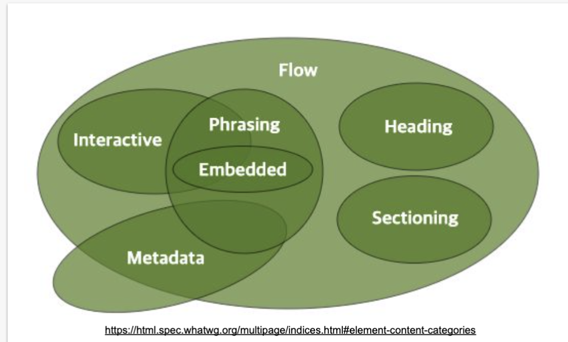
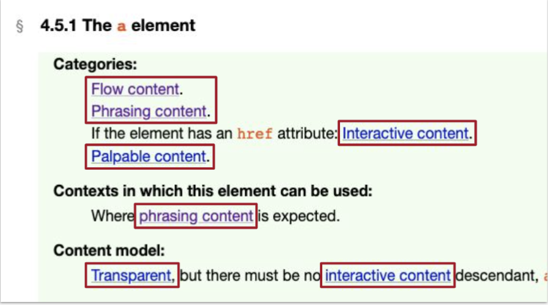

# 1.HTML을_어떻게_공부해야_하는가

## Quiz
   ```
   <a>Is it valid?</a>
   ```
   Yes!

##  HTML
1. 문서의 골격
2. 문서의 의미 부여

<br>

## HTML 표준 명세를 통해 이해하자

## 기존 HTML 학습 경로
1. https://w3schools.com/
2. https://developer.mozilla.org/
3. 초심자 전용
4. 정보량 한계
5. Superseded 폐기 된

## Since 2019년 HTML 학습 경로 (Living standard)
0. https://html.spec.whatwg.org
1. whatwg: Web Hypertext Application Technology Working Group
2. 현재 공식 표준
3. HTML을 유지하고 발전시키는 커뮤니티
4. 브라우저 제조사 연합(구글, 애플, 마이크로소프트, 모질라)
5. HTML 표준은 탈 권위적이고 살아있는 것이 됨 (버전 사라짐)
6. W3C HTML 명세는 대체(폐기)됨
   

## implemented standard 현재 브라우저에서 구현되는 표준
0. https://caniuse.com
1. 웹 표준 명세의 브라우저 구현 현황을 확인
2. 공식 표준이라도 브라우저 제조사가 구현하지 않으면 의미 없음

## 주요 HTML 콘텐츠 분류

1. HTML5 이전과 이후 분류가 다름
2. block container => flow content
3. inline container => phrasing content
4. 그 외 다양한 카테고리가 생김 => 명세 이해에 중요

## 주요 HTML 콘텐츠 분류

### flow content
1. body에 포함할 수 있는 모든 요소
   ```
   a, abbr, address, area, map, article, aside, audio, b, bdi, bdo, blockquote, br, button, canvas, cite, code, data, datalist, del, details, dfn, dialog, div, dl, em, embed, fieldset, figure, footer, form, h1, h2, h3, h4, h5, h6, header, hgroup, hr, i, iframe, img, input, ins, kbd, label, link, main, map, mark, math, menu, meta, meter, nav, noscript, object, ol, output, p, picture, pre, progress, q, ruby, s, samp, script, section, select, slot, small, span, strong, sub, sup, svg, table, template, textarea, time, u, ul, var, video, wbr, autonomous custom elements, text
   ```
2. base, style, title 을 제외한 나머지 모든 요소

### Metadata content
1. 콘텐츠와 문서를 구조화 하는 요소를 의미
2. 다른 콘텐츠의 표시, 동작, 관계 등을 설명
   ```
   base, {link}, {meta}, {noscript}, {script}, style, {template}, title
   ```
3. {일부 요소}는 경우에 따라 플로우 콘텐츠
4. css
   ```
   display: none;
   ```

### heading content
1. 섹셔닝 콘텐츠의 헤더
   ```
   h1, h2, h3, h4, h5, hgroup
   ```
2. 섹셔닝 콘텐츠가 없어도 헤딩 콘텐츠가 있으면 암시적으로 섹션(===문서의 개요)이 형성된다
   ```
   display: block;
   ```

### sectioning content
1. 문서의 개요를 형성
2. 헤딩, 헤더, 푸터의 범위
   ```
   article, aside, nav, section
   ```
3. 각 섹셔닝 콘텐츠는 암시적인 개요를 형성
4. 섹셔닝 콘텐츠와 헤딩 콘테츠를 함께 사용하면 명시적인 개요를 형성
   ```
   display: block;
   ```

### phrasing content 프레이징 콘텐츠
1. 구문 콘텐츠
2. 단락을 형성하는 콘텐츠
3. ```
    a, abbr, area, audio, b, bdi, bdo, br, button, canvas, cite, code, data, datalist, del, dfn, em, embed, i, iframe, img, input, ins, kbd, label, {link}, map, mark, math, {meta}, meter, {noscript}, object, output, picture, progress, q, ruby, s, samp, {script}, select, slot, small, span, strong, sub, sup, svg, {template}, textarea, time, u, var, video, wbr, autonomous custom elements, text
   ```
4. css   
   ```
   display: inline | inline-block | {none};
   ```

### embedded content
1. 외부 자원을 참조하는 콘텐츠
   ```
   audio, canvas, embed, iframe, img, math, object, picture, svg, video
   ```
3. 모든 임베디드 콘텐츠는 구문 콘텐츠이다
4. 외부 자원을 지원하지 않는 경우 대체 자원을 명시할 수 있다
   ```
   display: inline | inline-block;
   ```

### interactive content
1. 사용자와 상호 작용할 수 있는 콘텐츠
   ```
   a, audio, button, details, embed, iframe, img, input, label, select, textarea, video
   ```
2. 입력 장치(키보드, 마우스)로 조작 가능
   ```
   display: inline | inline-block;
   ```

### palpable content
1. 비어 있지 않은, 볼 수 있는 콘텐츠
2. hidden 속성이 없는
   ```
   a, abbr, address, article, aside, audio, b, bdi, bdo, blockquote, button , canvas, cite, code, data, details, dfn, div, dl, em, embed, fieldset, figure, footer, form, h1, h2, h3, h4, h5, h6, header, hgroup, i, iframe, img, input, ins, dbd, label, main, map, mark, math, menu, meter, nav, object, ol, output, p, pre, progress, g, ruby, s, samp, section, select, small, span, strong, sub, sup, svg, table, textarea, time, u, ul, var, video, autonomous custom elements, text that is not inter-element whitespace
   ```
   
### script-support element 스크립트 지원 요소
1. 렌더링하지 않지만 사용자에게 기능을 제공
   ```
   script, template
   ```

### Transparent content models 투명 콘텐츠 모델
1. 투명 콘텐츠 모델
2. 부모의 콘텐츠 모델을 따른다
    ```
    a, ins, del, object, video, audio, map, noscript, canvas
    ````
3. 투명한 요소를 제거해도 부모와 자식 관계가 문법적으로 유효해야 한다

### html5 living standard 키워드로 검색

## 요약
1. living standard (whatwg)
2. implemented standard (can i use)
3. element (tag name)
4. category
5. context (=== 부모 요소의 콘텐츠 모델 유추 가능)
6. content model (===자식 요소의 카테고리)
7. transparent content model

## 퀴즈
1. https://t.ly/aJWB

## 참고
- https://html.spec.whatwg.org/multipage/dom.html#kinds-of-content