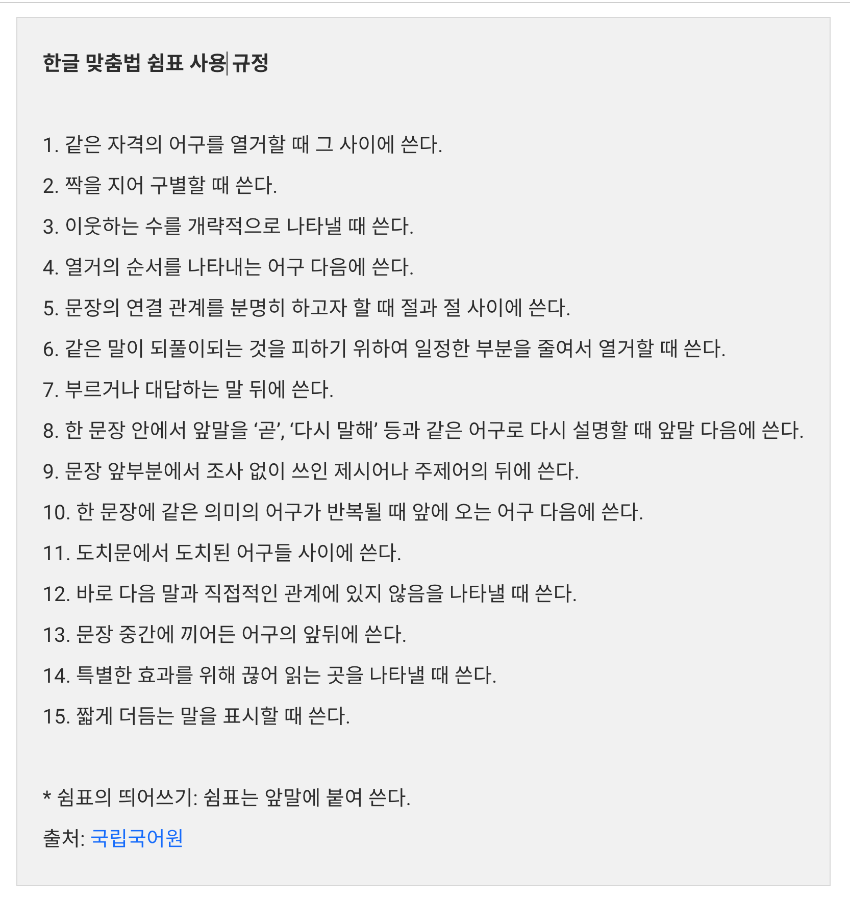

# 기술문서의 쉼표 사용 가이드라인

## 쉼표의 사용 경향

- 긴 호흡의 문장에서 끊어 일기를 하거나 단어 등을 열거 할때

## 잘못된 쉼표에 대한 논문인, 공문서의 띄어쓰기와 문장 부호 오류 양상

- 쉼표 사용의 오류 빈도를 조사한 결과 한 공문서 당 무료 28번의 오류가 발생함.

## 예시

- 삽입구 등 복잡한 문장구조 사용으로 쉼표를 혼용한 예시
  - 도시에서의 삶은 정신없이, 커피 한잔의 여유도 없이, 이렇게 또 하루가 흘러가는데, 어떤 생각에 잠겨 있나요.

- 외국어의 영향을 받아 쉼표를 혼용한 예시
  - 대한민국은, 동북아시아에 위치한 반도 국가로, 세계 10위권 경제 규모를 지닌 강대국이며, 중국 일본 등과 접하고 있습니다.

## 쉼표 사용에 대한 혼란

- 실제로, 개발자와 테크니컬라이터 등 여러 작업자가 협업하는 기술문서 작업 과정에서도 꽤 빈번하게 발견됨.
- 예시로, 작업자 A는 가독성을 위해 문장에 쉼표를 사용했는데, 이를 읽은 작업자 B는 해당 쉼표를 불필요한 요소라고 생각해 제거하는 등 작업자 간 일관된 스타일의 기준이 없음.

## 쉼표 어문 규정 분석

- 쉼표는 우리의 언어 생활 속에서 흔히 사용되지만, 막상 쉼표에 대한 어문 규정이 구체적으로 언급되는 경우는 드믈다.

- 헷갈리는 맞춤범이나 띄어쓰기 규정은 자주 검색하여 찾아보는데에 비해서 말이다.

- 한글 맞춤법에서 쉼표 사용을 어떻게 규정하고 있는지 살펴보면

### 한글 맞춤법 규정

- 한글 맞춤법 규정의 부록인 문장 부호에는 쉼표의 사용 규정을 총 15가지로 제시하고 있다.
- 쉼표의 사용 규정 15가지를 유형에 따라 분류하고, 기술문서 작성과 관련된 쉼표 규정의 모호함에 대해 논의해보았다.
- 이 포스팅에서는 15개의 쉼표 사용 규정 중 가장 많이 사용되는 3개 규정을 선정하여 쉼표의 사용 용법과 용례 등을 살펴본다.

- 

### 열거의 쉼표

- 가장 기본적인 용법 중 하나이다.
- 기본적으로 같은 자격의 단어, 구 또는 절이 연이어 나올 때 쉼표를 사용한다.

#### 용법1

- (1) 같은 자격의 어구를 열거 할때 그 사이를 쓴다.
- 예) 근면, 검소, 협동은 우리 겨례의 미덕이다.
- 역할
  - 각 어구를 구분하거나, 문장을 읽을 때 호흡을 조절
  - 같은 자격의 어구들이 열거되어 있음을 쉽게 파악 가능

#### 용법 2

- (1) 짝을 지어 구분할 때 쓴다.
- 예) 한국과 일본, 필리핀과 베트남은 각각 동북아시아와 동남아시아에 있는 국가들이다.
- 용법 1과 차이점
  - 나열된 어구들은 짝을 지어 구별하여 쉼표를 사용
  - 예시 문장을 보면, 같이 '한국, 일본, 필리핀, 베트남'이라고 나열하는 것보다, 뒤에 명시된 '동북아시아'와 '동남아시아'로 구분하여, 이에 속한 해당하는 나라들은 '한국과 일본', '필리핀과 베트남'으로 구분하여 나타내면 훨씬 더 문장을 이해하기 좋다.

#### 문장 구조의 쉼표

- 문장의 연결 관계, 문장 성분의 생략 등과 관련된 용법으로 열거의 쉼표와는 구별된다.

#### 용법 4

- (4) 열거의 순서를 나타내는 어구 다음에 쓴다.
- 예시
    1. 첫째, 일찍 자고 일찍 일어나야 한다.
    2. 마지막으로, 꾸준한 운동이 필요하다.
- 해설
  - '그리고, 그러나, 그런데, 그러므로 ....' 등과 같은 접속 부사의 뒤에서는 쉼표를 쓰지 않는 것이 자연스럽다.
  - 접속 부사와 쉼표의 기능이 중복되는 면이 있기 때문이다.
  - 그런데 쉼표는 꼭 접속의 기능만 하는 것이 아니므로, 글쓴이가 필요하다고 판단 시 접속 부사의 뒤에서도 쉼표를 쓸 수 있다.
    - 예시
        1. 노래는 감정이다. 그러므로, 노래를 강권한다는 것은 감정을 강요하는 것과도 같은 일이다.
        2. 네 말도 일리는 있다. 그렇지만 우리는 다른 사람들의 의견에 따라야 한다.
- 사용하는 경우
  - 여러 내용을 열거할 때 사용되는 '첫째, 둘째..'와 '먼저, 다음으로, 마지막으로 ...' 등과 같은 순서 어구 다음에 쉼표를 사용한다.
- 특이한 점
  - 문장 구조의 쉼표라고 할지라도 국어에서는 '그리고, 그러나'처럼 접속 부사 뒤에는 쉼표를 쓰지 않는 것이 자연스럽다는 사실이다.
  - 기본적으로 접속 부사 다음에 쉼표를 쓰는 것을 원칙으로 하는 영어의 문법과 대조가 되는 부분이다.

#### 용법5

- (5) 문장의 연결 관계를 분명히 하고자 할 때 절과 절 사이에 쓴다.
- 예) 콩 심은 데 콩 나고, 팥 심은 데 팥 난다.
- 해설
  - 문장의 연결 관계가 쉼표 없이도 분명히 드러난다면 쉼표를 쓰지 않아도 된다.
  - 예) 발표회가 끝나면 바로 회사로 돌아가야 합니다.
- 사용하는 경우
  - 절(Clause)과 절 사이의 경계를 분명히 하여, 문장의 연결 관계를 명확히 할 때, 쉼표를 사용하는 용법이다.
  - 단, 해설에서는 쉼표 없이도 문장의 연결 관계가 명확하다면, 쉼표를 사용하지 않아도 된다고 명시되어 있으므로, 작성자의 주관이 개입될 수 있는 부분이다.

#### 용법6

- (6) 같은 말을 되풀이되는 것을 피하기 위하여 일정한 부분을 줄여서 열거할 때 쓴다.
- 예) 여름에는 휴양지에서, 겨울에는 스키장에서 휴가를 즐겼다.
- 사용하는 경우
  - 대응되는 문장 성분을 줄여 쓸 때 쉼표를 사용하는 경우에 사용하는 용법이다.
  - 예시에서 생략된 구절이 무엇인지 생각해 보면 "여름은 휴양지에서 (휴가를 즐겼고), 겨울에는 스키장에서 휴가를 즐겼다."일 것이다.
  - 이처럼 대응되는 문장 성분을 줄여 쓸 때는 쉼표를 사용해야 한다.

### 동격의 쉼표

- 서로 같은 격을 가진 단어, 구 또는 절을 쉼표로 연결하는 용법이다.
- 예를 들면, "A, 곧 B는 ~이다."라고 할 때, A = B의 관계가 성립하는 것을 생각해 볼 수 있다.
- 이런 경우에 동격의 쉼표를 사용하면 먼저 나오는 단어를 강조할 수 있습니다.

#### 용법8

- (8) 한 문장 안에서 앞말을 '곧', '다시말해' 등과 같은 어구로 다시 설명할 때 앞말 다음에 쓴다.
- 예) 책의 맨 앞부분, 곧 개요에는 책을 지은 목적이 드러나 있다.
  - "책의 맨 앞 부분 = 개요"가 성립하므로 동격의 쉼표로 볼 수 있다.

#### 용법9

- (9) 문장 앞부분에서 조사 없이 쓰인 제시어나 주제어의 뒤에 쓴다.
- 예) 열정, 이것이야말로 젊은이의 가장 소중한 자산이다.
  - "열정 = 이것 = 젊은이의 가장 소중한 자산"의 관계가 성립하므로, 동격의 쉼표로 볼 수 있다.
- 사용하는 경우
  - 문장 앞부분에 조사 없이 사용한 제시어나 주제어가 나올 경우, 그 뒤에 쉼표를 사용하는 용법이다.

#### 용법10

- (10) 한 문장에 같은 의미의 어구가 반복될 때 앞에 오는 어구 다음에 쓴다.
- 예) 그의 애국심, 몸을 사리지 않고 국가를 위해 헌신한 정신을 우리는 본받아야 한다.
  - "애국심 = 몸을 사리지 않고 국가를 위해 헌신한 정신"의 관계가 성립하므로 역시 동격의 쉼표이다.
- 사용하는 경우
  - 한 문장에 같은 의미의 어구가 반복 될 때 사용하는 쉼표이다.

## 참고

- (카카오 엔터프라이즈, 기술 문서의 쉼표 사용 가이드라인) <https://tech.kakaoenterprise.com/116>
