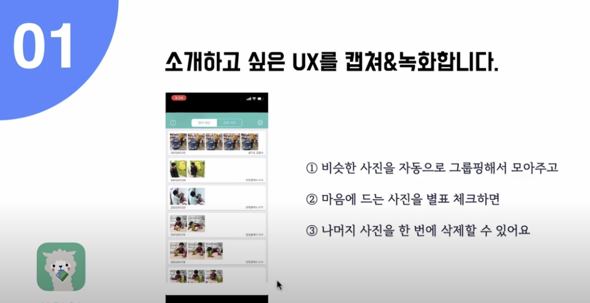
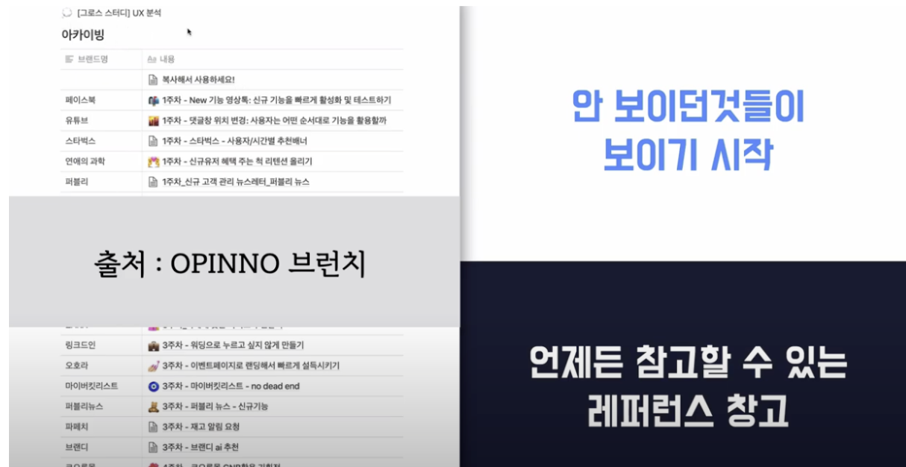

# OPINNO팀이 소개하는 UX 분석 스터디 방법

## 대상 앱
 - 애플 앱스토어 / ALPACA 사진 관리 앱

## 스터디 순서
 1. 소개하고 싶은 UX를 캡처 & 녹화
  

 2. 왜 캡처하게 되었나요? 어떤 점이 인상깊었나요?
  - 사진첩을 정리 할 때 비슷한 사진이 많으면 저장할 사진과 삭제할 사진을 고르기가 쉽지 않습니다.
     -  이유
       1. 알파카는 비슷한 사진을 자동으로 모아서 보여주고,
       2. 마음에 드는 사진을 체크해두면 나머지 사진을 일괄 삭제할 수 있습니다.
 3. 어떤 지표로 성과를 측정할 수 있을까요?
    1. 명확하게 측정하기는 어렵지만,
    2. 앱 다운로드 수, 재방문수, 앱 유지율을 측정하면
    3. ‘서비스 성장추이'와 ‘고객 충성도'를 확인 할 수 있다.
 4. 비슷한 사례가 있을까요?
 5. 개선 아이디어 & 브랜드 적용 안
    1. 개선아이디어 예시
        1. 사진청소기 앱처럼 유사도를 선택할 수 있는 기능!
        2. 100% 중복 된 사진을 한 번에 지우는 기능도 있으면 좋겠어요!
    2. 브랜드 적용 안
        1. 제가 담당하고 있는 프로덕트에 차용할 수 있는 부분은 딱히 없는 것 같습니다.

## 장점
  
 1. 안보이던 것들이 보이기 시작
 2. 레퍼런스 창고

## 스터디 주의사항
 - 발표 시간은 개인당 10분 (구성원이 부담스러움)

## 느낀점
 1. 그로스 해킹이란 것을 처음 알았다. 구인 구직 시 IT 직군으로 보았는데 자세히는 몰랐다.
 2. 그로스 해킹
    1. 창의성, 분석적인 사고, 소셜 망을 이용하여 제품을 팔고, 노출시키는 마케팅 방법
    2. growth와 hacking의 결합된 단어로, 고객의 반응에 따라 제품 및 서비스를 수정해 제품과 시장의 궁합(Product-Market Fit)을 높이는 것을 의미한다.
    3. 전체 개발 과정에 걸쳐 마케팅 아이디어를 제품에 녹여내는 전략
    4. 제품과 서비스를 성장시키기 위해 온라인 행동 데이터를 분석하며 이를 바탕으로 사용자 경험을 최적화 하는 것
    5. 고객의 웹사이트 방문 기록, 머무른 시간, 회원 가입으로 전환되는 비율 등 다양한 데이터를 기반으로 더 나은 서비스와 제품을 제공하기 위해 시도된다.
 3. 그로스 해커
    1. 마케터와 엔지니어가 결합된 형태
    2. AB 테스트, 랜딩 페이지, 구전 요소, 이메일 도달율, 오픈 그래프 등의 도구 사용 
    3. 자신들의 비즈니스의 핵심 성과 지표를 계속하여 성장시키는 사람
    4. 잠재력 있는 성장에 미칠 수 있는 모든 요인들을 면밀히 조사
    5. 지속 성장하는 기업들에게 가장 중요한 일
    6. 아이디어의 우선순위를 정하고 그로스 해킹 프로세스를 따르도록 훈련받아야 한다
    7. 아이디어를 테스트하고 분석할 수 있는 성장 동력을 지속적으로 유지하고 불필요한 리소스들 중에 어떤 것들을 줄일 것인지 분석 할 수 있어야 한다.
    8. 해당 프로세스가 신속하게 반복될수록 확장 가능하고 반복 가능한 방식으로 비즈니스를 성장시킬 가능성이 커집니다.
 3. 그로스 해킹 관련 도구
    1. AB테스트
    2. SEO
    3. AARRR
    4. KPI
    5. OKR
    6. NPS

## 참고
 1. https://brunch.co.kr/@chrisjeon82n3/82 그로스팀이 UX분석 스터디하는 법 by OPINNO
 2. https://www.youtube.com/watch?v=ra3EpF9WTow&list=PLVaJwjxYqkUIaS0UeNF1DRuLJ9sIREMLl&index=14 시청 후 정리
 3. https://ko.wikipedia.org/wiki/%EA%B7%B8%EB%A1%9C%EC%8A%A4_%ED%95%B4%ED%82%B9 그로스 해킹에 대한 위키
 4. https://brunch.co.kr/@josephvisioneer/40 그로스 해킹이란 무엇인가? 브런치