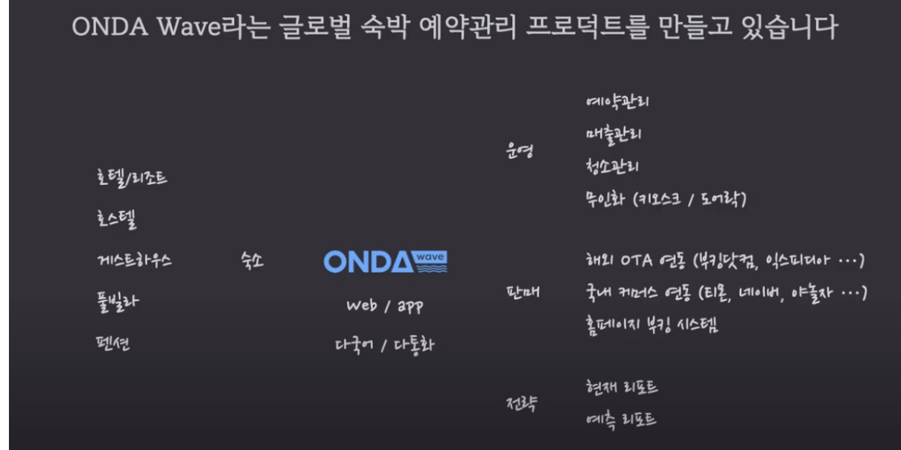
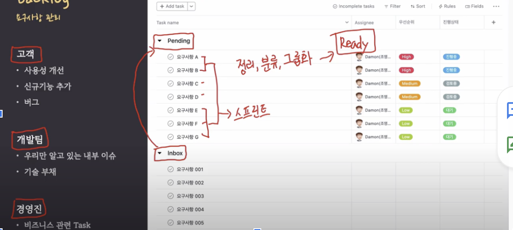
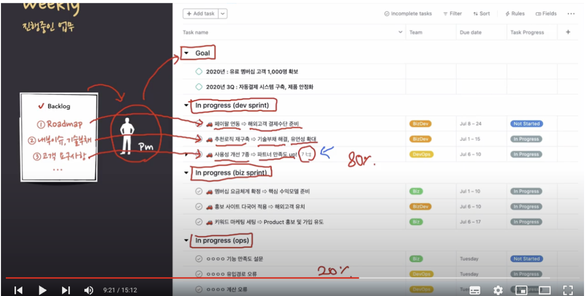
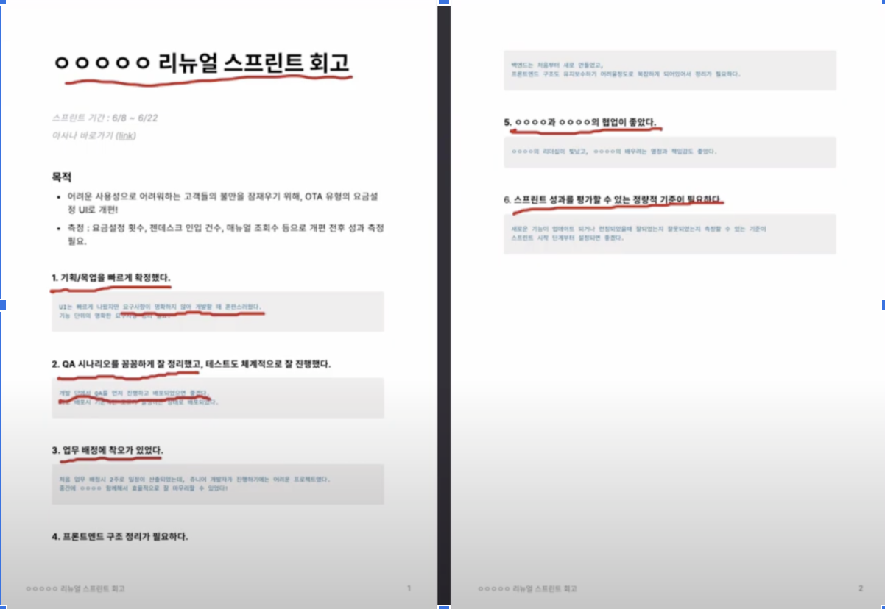

# 제품 관리자 (PO, PM)의 Product 일정관리 노하우

## IT 프로젝트 방법론
  - 워터폴 방식
    - 정의
        - 프로세스에 따라 단계적으로 구현하는 방식
    - 적합 예시
        - 대규모 데이터를 연동하는 B2B 플랫폼
        - 금융 플랫폼, 운영체제와 같이 한 번에 완제품을 출시해야 하는 경우
    - 애자일 방식
        - 정의
          - 최소 단위 제품(MVP)을 빠르게 출시해서 고객 피드백을 바탕으로 제품을 개선하는 방식
        - 적합 예시
          - 고객이 직접 사용하는 B2C 프로덕트
          - 고객을 사로잡아야 사업의 성패가 결정되는 프로덕트의 경우에는 애자일 방식
    - 두 방식 간 트레이드 오프 존재

## 애자일 방법론 도입 (예시 ONDA Wave)
  - 애자일 방법론 정석을 따르지 않고 상황과 자원을 참고하여 운영
    
  - 팀멤버 11명
    - 개발자 6명
    - ops 1.5
    - pm 1.5
    - owner 1
    - BD 1
    - 경영진
  - PM 주요 업무
    - Backlog 관리
        - Roadmap
        - 내슈이슈, 기술부채
        - 고객 요구사항
  - 툴 도입
    - 보통 큰 회사
        - atlassian JIRA를 Task를 관리하고 Confluence를 wiki로 이용
    - 예시 회사는
        - Asana를 Task를 관리하고 Notion을 wiki로 사용
 - 일정 관리
    
    - 요구사항 관리
        - 메뉴
            - 고객
              - 사용성 개선
              - 신규기능 추가
              - 버그
            - 개발팀
              - 우리만 알고 있는 내부 이슈
              - 기술 부채
            - 경영진
              - 비즈니스 관련 Task
        - Task 분류
            - inbox
                - 한줄 정도
                - to Pending
            - pending
                - 작업 가능한 형태로 정리, 분류, 그룹화
                - 텍스트 몇 줄~디테일한 설계 필요
                - to ready
            - ready
                - 정리된 테스트 모음
                - to weekly
        - 진행 중인 업무
            
            - weekly
                - 모든 멤버 접근 가능
                - 가독성 있게 서로 업무 파악 가능
                - Pm 고충사
                    - 직군마다 다 자기일이 중요하다고 우긴다(타 직군에 대한 이해가 완벽하지 않으므로)
                    - 논쟁에 대한 정리를 위해서 Backlog를 기반으로 Goal을 만든다
                    - Roadmap을 중시하는 경우 내부 이슈, 기술부채가 쌓일 수 밖에 없어서 지속적인 개발이 불가능할 수 있고, 고객 요구사항을 중점으로 하는 경우 Roadmap과 위반될 수 있다. 또 운영에 중점을 두는 경우 Roadmap을 진행하기 어렵다 (균형의 수호가 어렵다)
                    - 모든 직군을 납득시키는 어렵다. 가운데 껴서 욕받이 되는 경우가 많다.
            - 구성
                - Goal
                    - 목표
                - 스프린트 규칙
                    - (행동) => (목적) 을 스프린트 제목
                    - 기간 fix 아닌 flexible
                - In progress (dev sprint) 
                    - 80% 비중
                - In progress (biz sprint)
                - In progress (ops)
                  - 급한 운영 이슈 관리
                  - 20% 비중
                  - 다 급해보이지만 미룰 수 있는 것은 미루자. 우선순위가 운영인가 피처 개발인가에 따라 결정 가능

            - 회고
                - 피드백을 주고 받는 문화
                - 스프린트 참여 멤버들이
                    - 잘한점/ 개선할 점 각자 정리
                        - 개선할 점을 무조건 하나라도 적어야 한다
            - 회고 미팅
            - 최종 정리
                - 회고 미팅 정리
                - 전사적인 공유
            - 회고 미팅 후 요약 정리
                 
                - 회의 진행자가 정리하는 게 효과적
            - 피드백 반영
                - 예)  ㅇㅇㅇㅇㅇ 프로세스 개편
                - 팀 업그레이드

## 참고
  - https://www.youtube.com/watch?v=gg56Z_LlXvE&list=PLVaJwjxYqkULPliflQc2zkupv7XxQwfPw&index=21 를 시청 후 내용 정리
