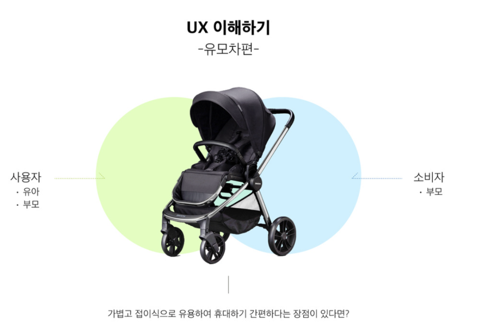
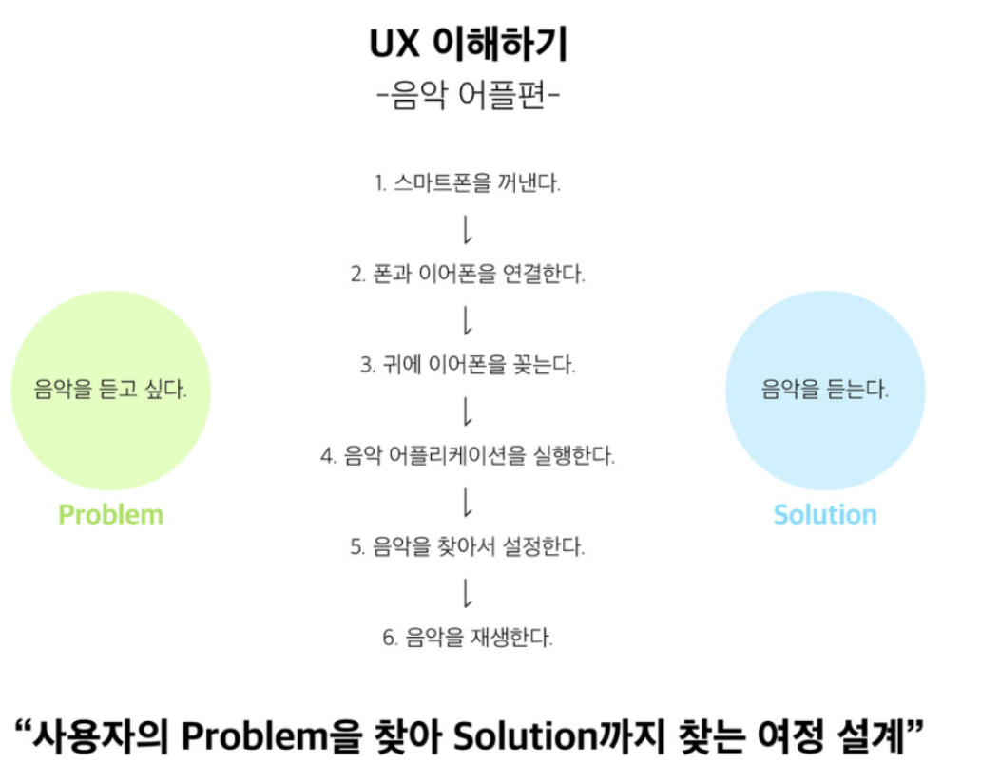
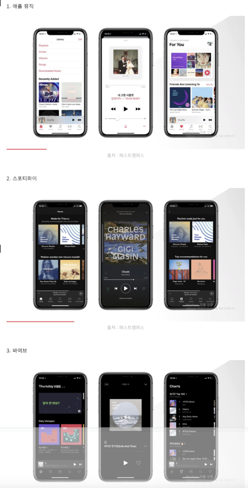
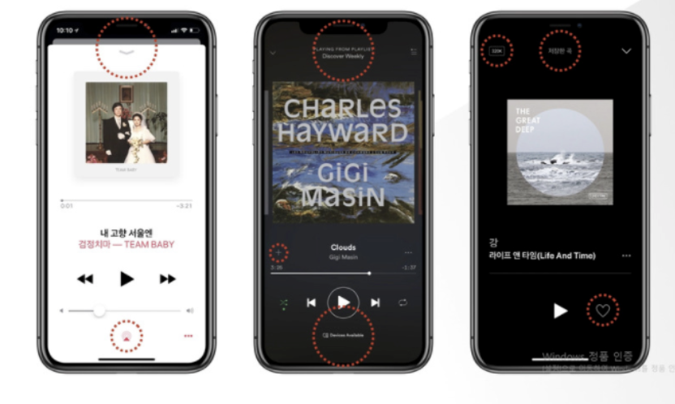
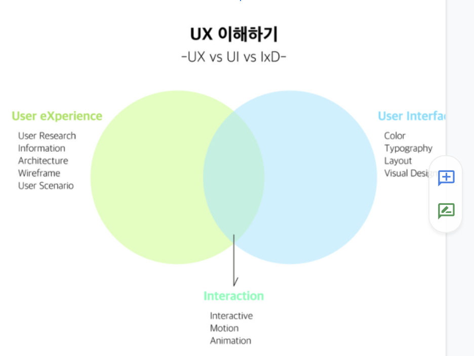

# UX 디자인 개론

## 정의
 1. User eXperience
 2. 유저 경험
 3. “이를 사용자가 제품, 서비스 혹은 시스템을 사용하거나 체험하는 데 있어 지각하는 것이 가능한 조직적 상호 교감적인 모델을 창조하고 개발하는 디자인의 한 분야” 
    - 의문
        - 무엇을 지각? 지각 범위는?
            - 답
                - 참고 https://brunch.co.kr/@jeongdaun87/5
        - 조직적 상호 교감적인 모델?
            - 답
                - 각 디자인 요소 별 상호 교감을 통해 새로운 가치에 대한 창조를 고려
  4. “사용자 경험 디자인은 사용자 중심의 디자인 원리에 기반하고 있어 인간공학, 인간과 컴퓨터의 상호작용, 정보 아키텍처, 사용자 인터페이스, 사용성 공학 분야와 많은 공통된 요소를 가지고 있다.”
  5. 개별적 제품이 가진 각각의 요소가 사용자에게 주는 감정의 총합

## 예시 1
 1. 대상 : 유모차
 
 2. 엔티티
    1. 소비자
        - 제품을 구매하고 소비하는 사람
    2. 유모차
        - 목적
          1.  유아에게 편리하고 적합하게 디자인
        - 사용자
          1. 유아
            - 유모차에 탑승
          2. 부모
            - 유모차를 끌고 다닌다
    3. 결론
        1. USER, NOT CUSTOMER
        2. UX는 소비자 경험 외 사용자 경험을 고민 (마케팅과 차별점)
           1. 의문
            - 마케팅과 UX의 차이점은?
## 예시 2
 - 디저트, 카페, 배경음악, 테이블, 의자, 조명, 바리스타, 커피, 사람들의 소음, 제품 냄새 등은 복합적인 상호작용을 통하여 카페에 어떠한 느낌을 주는 요소이다. (카페의 UX)

## UX 실제 예시
  
  1. Designing User Experience
   1. 오해
        1. 무언가를 그리거나 만드는 일이다
        2. 포토샵과 일러스트를 사용하는 사람이다
   1. 정의
        1. 디자인은 설계하다는 의미로 해석
        2. 즉, 사용자 경험을 설계한다

   2. 접근법 또는 관점
       1. 사용자를 자기 자신이라고 가정
       2. 음악을 듣고 싶다는 등의 생각을  Problem으로 정의
       3. 음악을 듣는 행위를 Solution
       4. UX 디자인이라는 것은 사용자의 문제를 찾아 해결책을 찾는 여정을 위한 설계 및 디자인
       5. 각 1번부터 6번까지의 과정이 일어나는 문제점들을 파악하고 해결하는 것을 고민하는 행위를 하는 것이 UX 디자이너이다.
  2. 실제 예시
    - 대상 : 애플 뮤직, 스포티파이, 바이브
    
  3. 각 애플리케이션 후킹 포인트
      1. 애플 뮤직 
           1. 강력한 라이브러리 기능
      2. 스포티파이 
           1. 사용자 취향 분석을 통한 새로운 곡 추천(디스커버리 기능)
      3. 바이브 
           1. 기분에 따라 선택하여 들을 수 있는 음악 추천 기능
           2. (한국인 맞춤 서비스)차트 100 기능
  4. 각 애플리케이션 별 재생 화면 비교
      1. 애플 뮤직
           1. 팝업창으로 화면 표시
      2. 스포티파이
           1. 각 음악과 카테고리 간의 연결성 강조
      3. 바이브
           1. 대부분의 아이콘 삭제
           2. 최소한의 기능만 화면에 제공
  5. 각 애플리케이션 별 제공 서비스 화면 비교
       
       1. 애플 뮤직
           1. 사용자들의 취향을 분석하여 맞춤 제공을 하는 서비스 강조
           2. 사용자가 선호하는 음악을 분석하여 이와 비슷한 새로운 곡 정보를 제공
           3. 이유: 애플리케이션 소비 타깃층이 글로벌 사용자
       2. 스포티파이
           1. 사용자들의 취향을 분석하여 맞춤 제공을 하는 서비스 강조
           2. 새로운 뮤지션을 발굴하고 이에 대한 음악과 정보를 제공하는 기능도 추가
           3. 이유 : 애플리케이션 소비 타깃층이 글로벌 사용자
       3. 바이브
           1. 차트 카테고리 제공을 통한 음악 순위를 알려주는 기능 강조
           2. 이유: 애플리케이션 소비 타깃층이 한국 
  6. 결론
       1. 각 회사에서, 또는 각 팀에서 추구하는 UX 개선 방향에 따라 제공되는 기능, 배치 등이 상이하게 달라진다.
       2. 해당 문서 내용으로는 정확하게 UX와 UI 차이점을 구분하기 어렵다.

## 추가 자료
   
   -  겹치는 부분은 ixD

## 참고
 - https://brunch.co.kr/@rladudrl305/1 를 참고하여 요약 정리