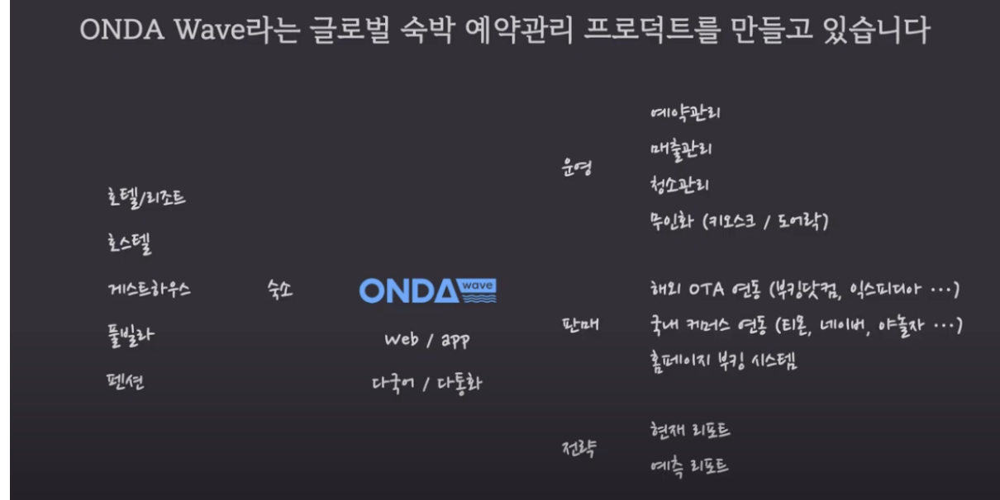

# 서비스 정책 깔끔하게 정리하기

## 예시를 통한 이해
 1. 고민
    - 배달 서비스의 회원가입 인증 방식
 2. 벤치마킹
    1. 이메일 인증
    2. SMS 인증
    3. 둘다 인증
 3. 표를 사용하여 장단점 파악을 통해 트레이드 오프 파악
 4. 결정을 위한 판단 기준 
    - 배달 서비스인 경우
        1. 주문확인 및 배달을 위해 정확한 고객 연락처가 필요함
        2. 40대, 50대도 쉽게 가입할 수 있어야 함
        3. 신규 가입자 프로모션을 적극 활용하기 위해서 중복 가입자를 필터해야 함
 5. 결정
  - SMS 인증
    

## 참고
 - https://www.youtube.com/watch?v=q6TyCviIf04&list=PLVaJwjxYqkUIaS0UeNF1DRuLJ9sIREMLl&index=16 시청 후 정리