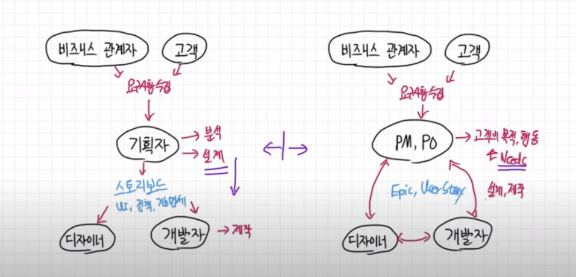
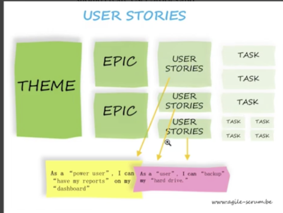
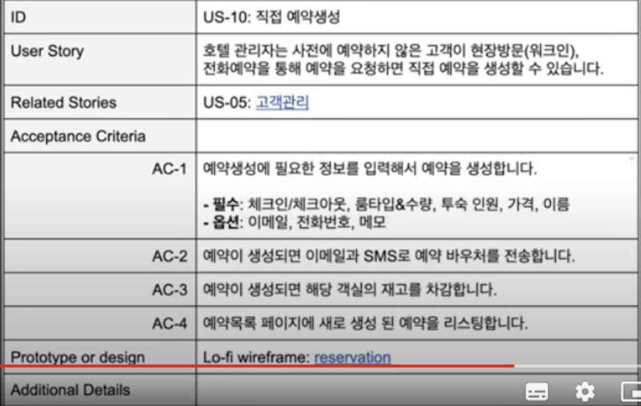
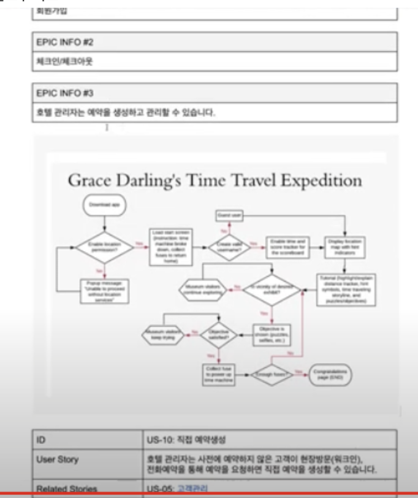

# 애자일 조직 제품 관리자의 고객중심 문서 작성 가이드 (에픽, 유저 스토리)

## 머리말
 - 애자일 조직에서 주로 사용하는 프로덕트 매니저의 문서
  
## 관계도
  
## 기획자
 1. 요구사항 수집 
    - from 비즈니스 관계자, 고객
 2. 분석
 3. 설계
 4. 스토리보드 제작
    1. 국내에만 존재하는?
        - 의문
            - 해외는 어떻게? 스토리보드 안쓰면 어떻게?
    2. UI, 정책, 기능 명세 중심
    3. 디자이너, 개발자가 제작 단계에서 참고

## PM, PO
 1. 요구사항 수집
    - from 비즈니스 관계자, 고객
 2. 고객의 목적, 행동, 니즈 정리
    1. epic, user story
    2. 고객 중심
    3. PM, PO와 디자이너, 개발자가 함께 설계, 제작 참여

## Epic, User story
 
 1. 제약사항
    - 글만 허용
# 예시 : 호텔 예약 관리 시스템
 1. EPICs
   1. EPIC INFO #1
      - 회원가입
   2. EPIC INFO #2
      - 체크인/체크아웃
   3. EPIC INFO #3
      - 호텔 관리자는 예약을 생성하고 관리할 수 있습니다.
 2. 유저 스토리
    
    1. US10: 직접 예약생성
        1. ID : US-10: 직접 예약생성
        2. User Story 
            - 예시
                - 호텔 관리자는 사전에 예약하지 않은 고객이 현장방문(워크인), 전화예약을 통해 예약을 요청하면 직접 예약을 생성할 수 있습니다.
        3. Related Stories
            - 목적
                - 연관 US 등록 with hyper link
        4. Acceptance Criteria 완료 기존 또는 통과 기준
            1. 단위
                - Task
            2. 완료 시
                - 디자이너와 개발자와 함께 아이제이션 진행
            3. 예시
                1. AC-1
                    1. 예약 생성에 필요한 정보를 입력해서 예약을 생성합니다.
                    2. 필수: 체크인/체크아웃, 룸타입&수량, 투숙, 인원, 가격, 이름
                    3. 옵션: 이메일, 전화번호, 메모
                2. AC-2
                    1. 예약이 생성되면 이메일과 SMS로 예약 바우처를 전송합니다.
                3. AC-3
                    1. 예약이 생성되면 해당 객실의 재고를 차감합니다.
                4. AC-4
                    1. 예약목록 페이지에 새로 생성된 예약을 리스팅 합니다.
            4. Prototype or design
                - 예시
                    - Lo-fi wireframe: reservation
            5. Additional Details
                - 추가 사항 기록
    2. US11: 자사 웹 
    3. US12: 타사 웹사이트 예약생성
 3. 플로우 차트
    
 1. 목적
    - epic 문서가 많은 경우 현황 파악이 어려울 수 있다
 2. 에픽과 유저 스토리 사이에 삽입

## 참고
 - https://www.youtube.com/watch?v=Z6tgjS3cMcA&list=PLVaJwjxYqkUIaS0UeNF1DRuLJ9sIREMLl&index=22 를 시청 후 요약 정리

목적
epic 문서가 많은 경우 현황 파악이 어려울 수 있다
에픽과 유저 스토리 사이에 삽입

