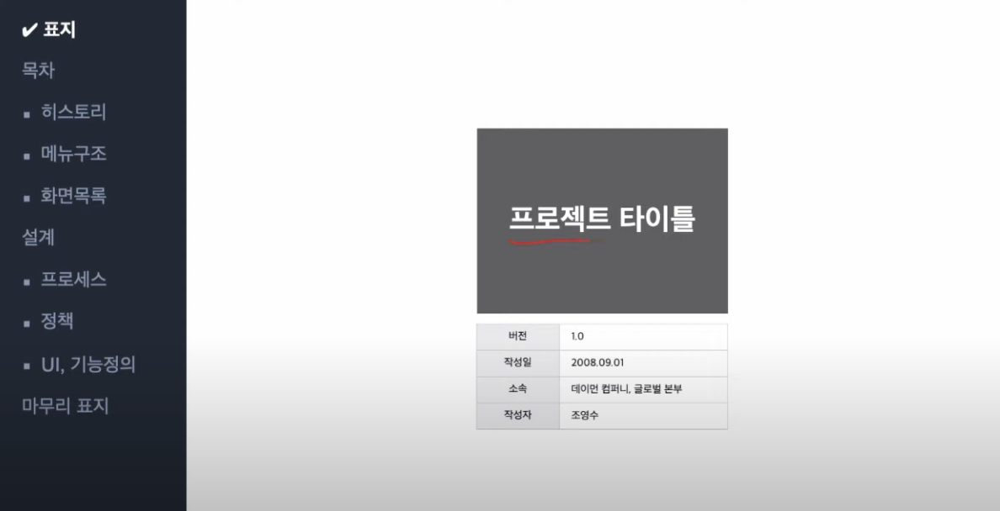
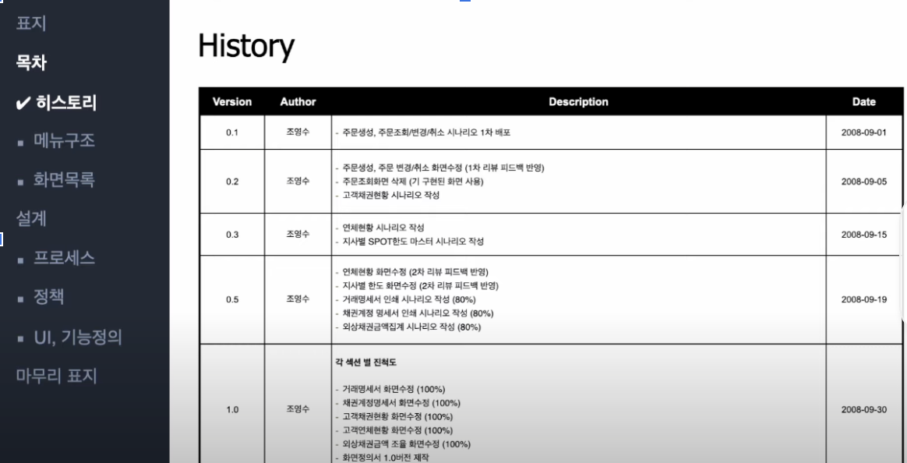
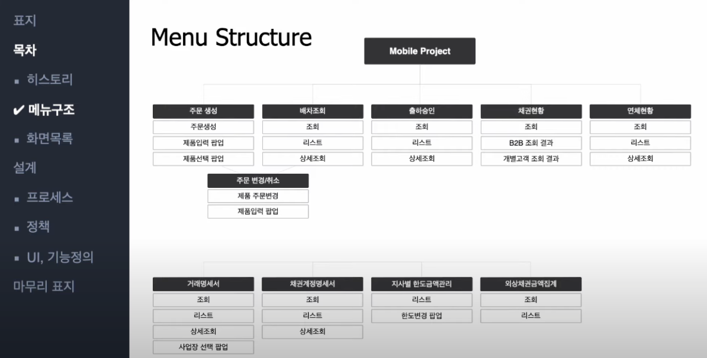
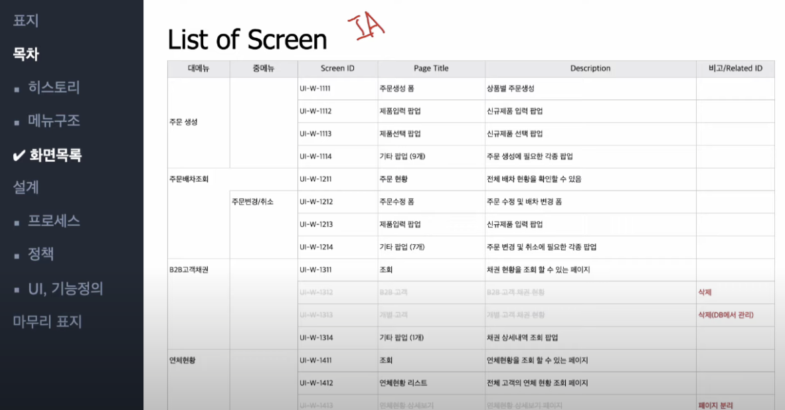
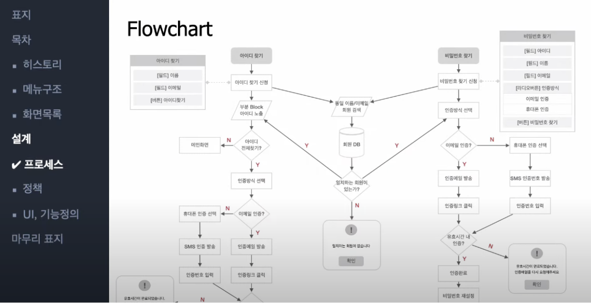
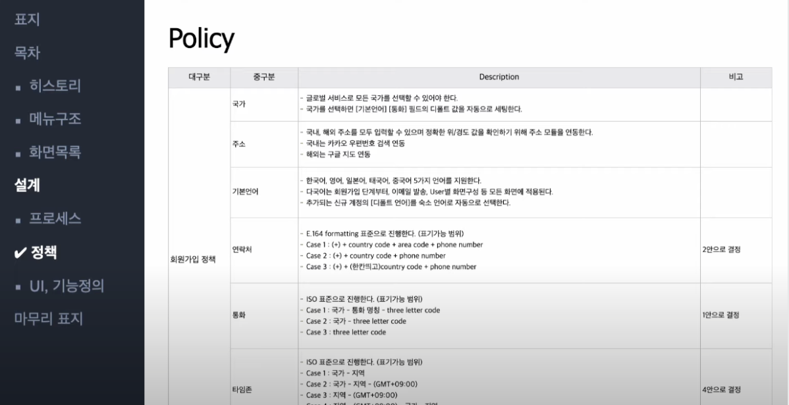
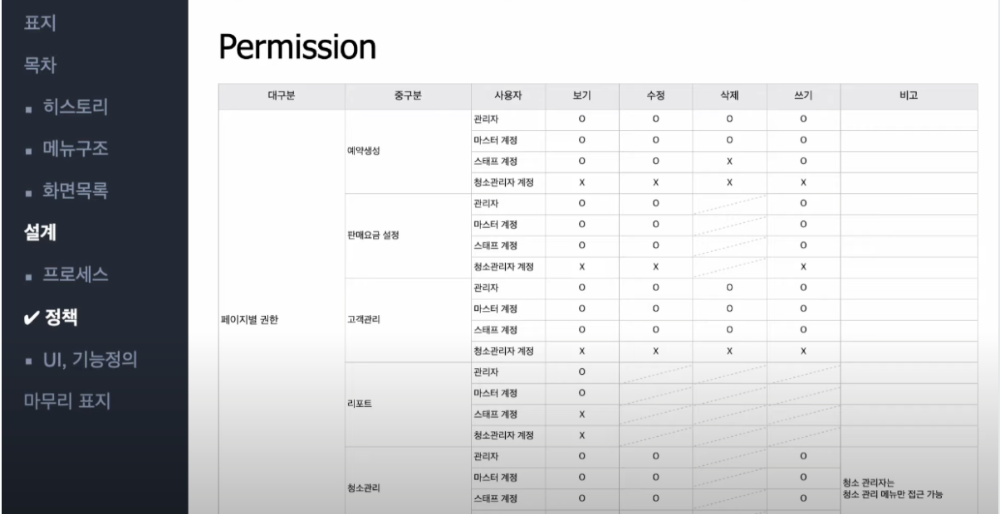
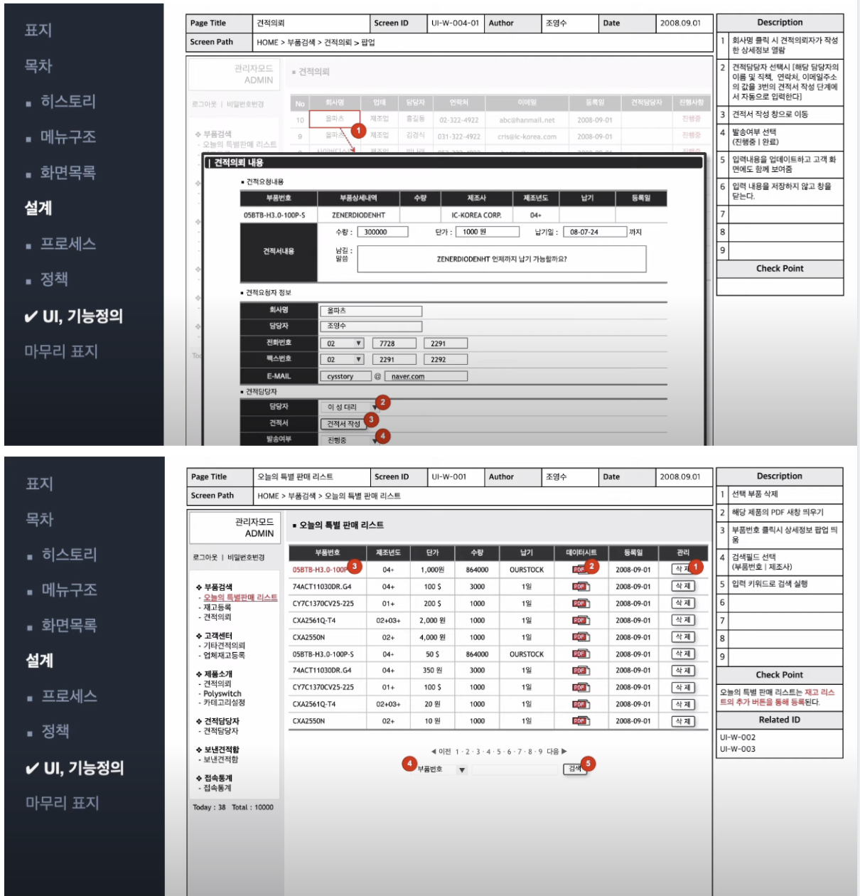
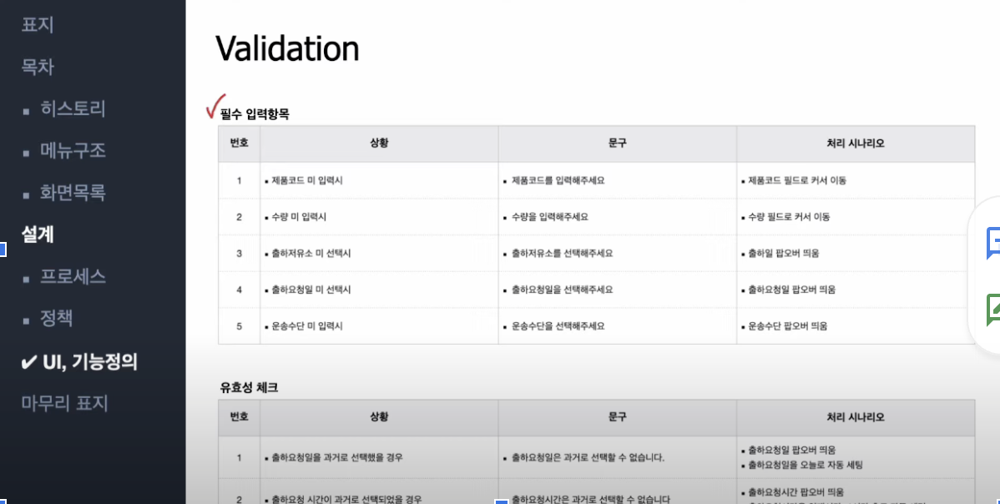

# 웹/앱 설계의 기본, 화면설계서(스토리보드) 작성방법

## 머리말
 1. 파워포인트는 2020년 9월 기준 가장 많이 사용하는 설계 툴.
 2. 파워 포인트 기준으로 설명

## 구성
 1. 표지
   
    - 내용
        1. 프로젝트 타이틀
        2. 버전
        3. 작성일
        4. 소속
        5. 작성자
 2. 목차 Index
     
 3. Revision History
    - 목적
        1. 버전 별 변경 사항을 기입
        2. 여러 직군에게 문서 공유 시 버저닝 일치 확인 필요
    - 내용
        - 버전 별
            1. Version
            2. Author
            3. Description
            4. Date
 4. Menu Structure
   
    - 목적
       1. 메뉴 형태를 시각적 트리화
       2. 프로젝트 사이즈 가늠

 5. List of Screen
   
    - 목적
       1. 화면 목록
       2. IA (Information Architecture)와 비슷한 맥락
       3. 문서에 담겨있는 전체적인 화면 목록의 리스트화
    - 내용
       1. 대메뉴
       2. 중메뉴
       3. Screen ID
       4. Page Title
       5. Description
       6. 비고/Related Id
    - 변경 시 
       1. 행 삭제가 아닌 변경을 시각화 처리

## 설계
 1. Flowchart 프로세스
    
    - 목적
      1. 복잡한 페이지에 적합
 2. Policy 정책
     
 3. Permission (비필수) 
    
    - 목적 
        1. 유저 별 분류가 많은 경우
    - 내용
        1. 대분류
        2. 중구분
        3. 사용자
        4. 보기 Read
        5. 수정 Update
        6. 삭제 Delete
            - 없는 경우 시각적인 블럭 처리
        7. 쓰기 Create
 4. UI 기능 정의
  
     - 내용
       1. 콘텐츠 상단 헤더의 내용은 메뉴 구조가 그대로 들어간다.
       2. Validation
           
           1. 필수 입력항목
           2. 유효성 체크
     - 모바일인 경우
    
 5. 마무리
    - 감사 인사 남기기

## 참고
 1. https://www.youtube.com/watch?v=ra3EpF9WTow&list=PLVaJwjxYqkUIaS0UeNF1DRuLJ9sIREMLl&index=14 시청 후 정리
 2. https://brunch.co.kr/@rladudrl305/15 5편. 디자인과 기획 | 브랜치