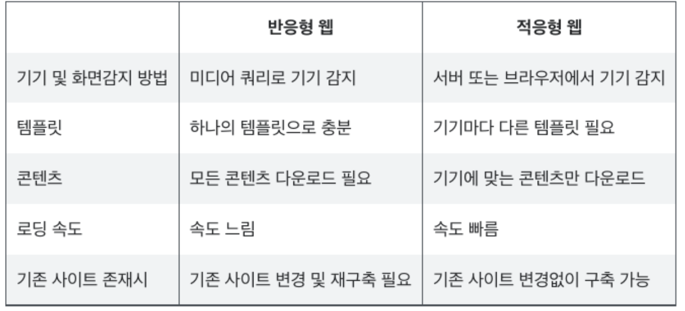

# 적응형_웹_해상도_및_반응형웹

## 고객 경험 향상
  - 다양한 해상도 지원
    - 브라우저 뷰포트의 가로 스크롤 또는 세로 스크롤에 영향을 줌 
        - 예시
            - 비교군
                1.  아마존
                    - 가로 1024 해상도에서 한 페이지에 필요한 정보를 보여 줌.
                2. 11번가
                    - 가로 1024 해상도에 한 페이지에서 필요한 정보를 보여주지 않는다. 
                    - 만일 가로 1024 해상도에 적합하지 않은 사용자가 사용 시
                        - 콘텐츠가 한 화면에 보이지 않는 부분에 의한 사용성 감소.
                        - 쇼핑몰인 경우상품 구매율 저하.
             - 최소 해상도 선정 기준은
                - 프로덕트 제작 시 서비스 국가의 최적화된 해상도를 기준으로 한다.
  - 실제 데스크탑 기준 해상도 예시
    1. 네이버 : 1080px
    2. 쿠팡 : 980px
    3. 11번가 : 1200px
    4. SSG : 1280px
    5. 29cm : 100%

## 웹사이트 제작 시점
  - 신규 오픈
    - 참고 데이터가 없는 경우 참고 사이트 목록
        - 네이버
            - 이유
                - 전국민이 사용 -> 수많은 데이터 분석 중 -> 해상도 선정 -> 전국민이 편한 해상도
    - 리뉴얼 오픈
        - 생략

## 사이트 해상도 확인 방법
  1. Local 
     - 캡처 프로그램 사용 -> 캡처 범위 지정 
     - 크롬 / 도구 더보기 / 개발자도구 / 셀렉트 버튼을 통해 DOM 객체 선택 / style 의 width, height 참고 / 브라우저 width를 줄이면서 상세 확인
  2. 외부
     - http://gs.statcounter.com (국가 별 사용자 정보 파악 가능)
        - 전세계 웹사이트 트래픽을 통해 각종 통계 정보 제공
        - 사용법
            - 최근 1년의 대한민국, Desktop을 통해 조회 시 한국의 Desktop 해상도 파악 가능
        - 결과값 분석
            - 대한민국은 가로 1280보다 크면 대부분 고객을 커버할 수 있다.
            - 단 스크롤 바 영역도 고려해서 1260 정도가 적정
     - 구글 애널리틱스 (해당 서비스 고객에 대한 상세 정보 파악 가능)
        - 사용법
            - 잠재고객 메뉴 / 기술 / 브라우저 및 운영 체제 / 사용 해상도
            - 기기 카테고리 속성 추가
            - 고급 / 기기 카테고리  / desktop 

## 의문
 - 최소 해상도를 가로 500으로 맞춰서 모든 것을 지원하는 경우는 단점이 무엇일까? 모든 해상도를 지원하는 방법은 최소 해상도를 최소 값으로 픽스해버리면 될 것 같다는 개인적인 생각이 든다.
    - 답
        - 해상도 뿐 아니라 반응형 웹 100% 방식을 통해서 모든 해상도 지원이 가능
            - 의문
                - 반응형 웹 100%(width 구간의 상세에 따라 특정 width에서는 반응형 100%가 성립되지 않을 수 있다)와 해상도 방식의 차이 및 각각의 장단점은?

## 반응형 웹과 적응형 웹
  
  - 적응형 웹과 반응형 웹의 주요 차이점
    1. 사이트 설계부터 구동까지 많은 차이 존재
    2. 적응형 웹은 클라이언트 측이 아닌 서버측에서 사용자의 디바이스를 확인하고 그 디바이스를 기초로 하여 HTML 및 CSS 코드의 다른 배치를 제공
    3. 반응형 웹은 서버 측이 아닌 클라이언트측에서 사용자의 디바이스에 따라 동작
  - 반응형 웹
    - 정의
        - 미디어 쿼리(구간에 따른 별도 스타일 정의) 및 그리드를 활용하여 화면의 크기를 확인하고 유연한 이미지와 그리드로 화면 크기의 변화에 따라 그에 맞는 크기가 된다.
    - 장점
        1. 하나의 템플릿만을 사용
            - 다양한 사용자와 기기에 대응을 위한 개발 간소화
        2. 새로운 웹 피처 추가가 상대적으로 용이
        3. 단점
            1. 하나의 기기만으로 접속 시 모든 기기를 위한 CSS를 전부 다운로드 필요
                - 즉, 데이터 낭비 및 로딩 시간 증가
                    - 의문
                        1. 기기의 해상도가 고정인 경우는 필요한 CSS의 미디어 쿼리만을 필터링 후 제공하면 어떨까?
                        2. 위 처럼 CSS 미디어 쿼리만을 필터링 하는 방식은 필터링 하는 연산 자체에 의해 사용자에게 컨텐츠를 제공하는 속도에 병목을 만들 지 않을까 추측. 
                        3. 기기 해상도가 고정인 경우는 CSS 설계 시 아토믹 CSS(media query 별 별도 파일로 분리)를 통해 해당 해상도에 맞는 CSS 파일만을 제공하는 것은 어떨까? 
                        4. 기존에 이미 운영 중이었던 데스크톱용 사이트가 적응형인 경우 사이트 재구축 필요
            2. 사용자 환경 및 기기에 따라 디바이스에 따라 성능 저하 발생 가능
    - 반응형은 만능이 아니다
        1. 특정 디자인 컴포넌트는 기능에 따라 모든 반응형 대응에서 호환성을 보장하기 불가능
        2. 해상도를 여러 단계의 구간으로 나눌 때 구간 간 차이가 클수록 반형의 각 단계 사이에서 반응형이 깨질 확률이 크다.

## 적응형 웹
  1. 정의
     - 서버 또는 클라이언트에서 웹에 접근한 디바이스를 체크하여 그 디바이스에 최적화된 마크업을 호출
  2. 장점
        1. 기존에 이미 데스크탑용 템플릿을 작성시 처음부터 재구축할 필요가 없다. 다른 기기용 템플릿만 다시 만들면 된다.
        2. 사용자의 기기에 맞는 템플릿 및 CSS만 다운로드하면 된다. 데이터 낭비가 적고 로딩 속도가 빠르다.
            - 의문 
                1. 서비스의 성질 및 회사 자원에 따라 적응형 웹 정책이 다르겠지만 개인적인 추측은 데스크탑용 템플릿 1개, 기기별 템플릿 1개로 최소한의 갯수로 운영하지 않을까 싶다.
                    - 답
                        - 국가별인 경우 국가별 최소 해상도가 다를 수 밖에 없다. 비즈니스 성질에 따라 국가별 대응이 필요한 경우가 존재한다.
  3. 단점
     - 각 기기별로 별도의 템플릿을 작성해야 하므로 개발 및 유지보수 및 확장이 어렵다.

## 참고
 1. https://www.youtube.com/watch?v=KG82YY1Rm9w&list=PLVaJwjxYqkUIaS0UeNF1DRuLJ9sIREMLl&index=5 유투브 시청 후 내용 정리
 2. https://studio-jt.co.kr/%EB%B0%98%EC%9D%91%ED%98%95-%EC%9B%B9-%EA%B7%B8%EB%A6%AC%EA%B3%A0-%EC%A0%81%EC%9D%91%ED%98%95-%EC%9B%B9/
