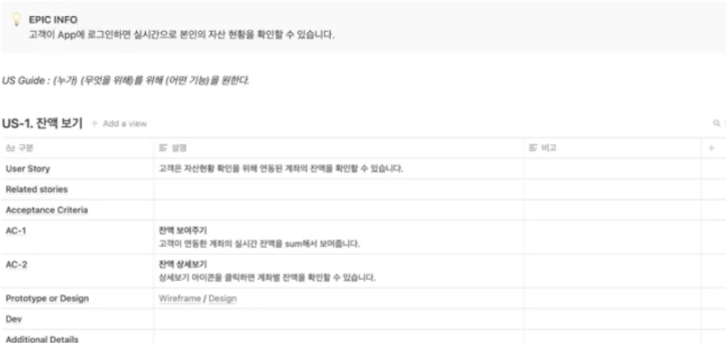

# 제품 팀에서 Notion, Axure, Figma로 기획/디자인하기! 

## Notion
 1. 문서 정리
 2. 제품 명세 정리
## Axure
 1. 프로토타이핑
 2. 간단한 와이어프레임
## Figma
 1. 생략
## 예시 : 자산 관리 앱

 1. Notion
    
    1. Home
        1. Epic INFO
            - 고객이 App에 로그인하면 실시간으로 본인의 자산 현황을 확인할 수 있습니다.
        2. User stories
            1. 잔액보기
                - User story
                    - 고객은 자산현황 확인을 위해 연동된 계좌의 잔액을 확인할 수 있습니다.
            2. 지출 내역 요약 보기
                - User story
                    - 고객은 소비 습관 관리를 위해 카테고리별 지출내역을 볼 수 있습니다.
            3. 최근 지출 내역
                - User story
                    - 고객은 다른 페이지로 이동하지 않고 최근 지출내역을 바로 확인할 수 있습니다.

## Tip
 1. 기능 명세 후 와이어프레임, 디자인을 잡으면 꼭 필요한 기능 중심의 프로덕트 생산 가능
    - 순서
      1. 기능 별 꼭 필요한 기능인가? 얼마나 걸리나? 무엇이 빠졌나 등 상호 피드백을 통해 명세 보강
      2. 제품에 대한 와이어 프레임 제작
      3. 각 단계 별 다른 단계로 이동을 위한 Link 삽입 필수
        - 심플한 유지보수 및 확장 가능
 2. 피그마로 제품 간단히 제품 UI 그리기 또는 와이어 프레임?
    1. 전문 디자인 툴은 와이어 프레임에 최적화 되어있지는 않아서(예: 박스 생산 과정이 더 많다) 생산성이 낮다
    2. 전문 디자인 툴은 와이어 프레임의 본 목적보다 디자인에 개입하게 될 가능성이 존재한다.
        > 관심사 분리 관점에서 디자이너가 존재하는 경우디자인 영역은 디자이너에게 위임
