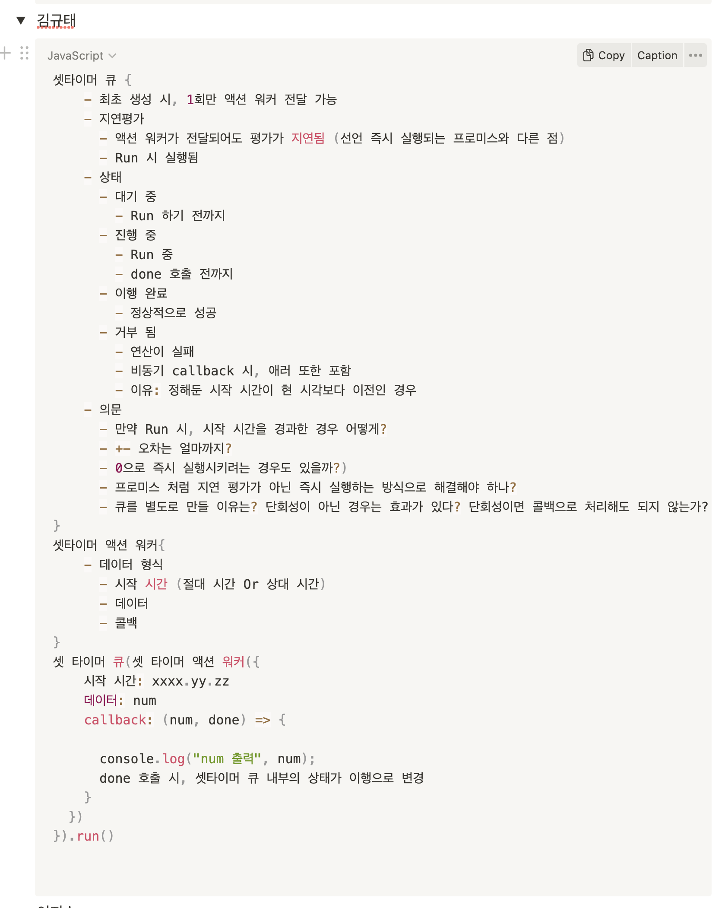

## 발제문

### 1. UpdateX는 재귀로 구현됨. 안전한 재귀 사용법?
- 답변
	- 핵심 : 안전한 재귀란 정상적인 재귀 호출와 정상종료(무한 호출 방지)가 되어야 한다. 
	- 정상적인 재귀 호출
		- 재귀 호출 
		1. 재귀함수는 최소 하나의 재귀 호출(recursive call)이 필수이다.
		2. 호출이 필요한 곳에서 재귀 호출이 있어야만 한다. (정상적인 재귀가 되도록)
	3. 정상 종료 (무한 호출 방지))
		1. 종료 조건 (무한 호출 방지)
			1. 재귀를 멈추려면 종료조건 (base case)가 필요하다.
			2. 위치
				1. 재귀가 멈춰야 하는 곳이다.
				2. 더는 재귀 호출을 하지 않으므로, 그 위치에서 재귀가 멈춘다. 
		3. 종료 조건에 다가가기 (무한 호출 방지)
			1. 재귀 조건을 만든다면 최소 하나 이상의 인자가 점점 줄어들어야 한다.
			2. 그래야만 종료 조건에 가까워질 수 있다.
			3. 주의점
				1. 재귀 호출에 같은 인자를 그대로 전달
					1. Stack Overflow 발생

### 2. Cut과  JustOnce는 언제, 왜 사용? (동시성 기본형)
- 답변
	- 핵심
		- 두 동시성 기본형의 핵심은 병목현상 제거에 있다.
		- 동시성이 큐를 쓰는 이유를 파악할 수 있다.
	- Cut
		- 언제, 왜
			- 순차적으로, 비동기 간 순서 간 의존성이 없음에도 concat 방식으로 비동기를 처리하면, 너무 병목이 심할 수 있다.
		- 동작 방식
			- 병렬 비동기 실행 시, 타임라인을 앞부분과 뒷부분으로 나눈다.
				- 컷의 앞부분과 뒷부분에 있는 액션은 섞이지 않는다.
				- 타임라인 앞과, 뒤를 별도로 분석 가능하다.
				- 즉 실행 가능한 순서를 줄이므로, 애플리케이션 복잡도를 낮춘다.
		- 효과
			- 경쟁 조건(race condition)을 막는다.
				- 경쟁 조건?
					- 어떤 동작이 먼저 끝나는 타임라인에 의존할 때 발생한다.
				- 즉, 여러 타임라인이 실행되는 순서를 신경쓰지 않아도 되고, 타임라인이 모두 끝나는 것도 쉽게 처리할 수 있다.
			- 유저 사용성 향상
	- JustOnce
		- 언제, 왜
			- 기능상 단일 액션에 대해서, 마지막 액션만으로도 유효한 경우. (병목현상 방지)
		- 동작 방식
			- 같은 액션 기준으로, 여러 번 호출해도 한 번만 실행되도록 만든다.
				- (RxJS switchMap처럼) 어떤 액션에 한 번만 실행되는 슈퍼 파워를 주는 고차함수이다.
		- 효과
			- 효율적인 concurrncy, 유저 사용성 향상
		- 맥락
			- JS 특성인 싱글스레드 특성을 활용해서 쉽게 구현 기능
				- 즉 구현 시 타임라인 사이에 변수가 공유되더라도 돈케어이다.

### 3. 동시성 기본형을 응용
- 문제 정의
- 	마지막으로 호출할 때 넘긴 num가 console로 출력된다.
- 	내가 설정한 시간대에 callback이 호출되어야 한다.
- 답변
- 	
- 피드백
	- **Queue인데, 큐에 상태가 있는게 아닌, 각 액션워커에 넘긴 액션에 대한 상태가 있는게 옳다.**
	- 워커 내 콜백 안에 timeout을 넣는것 보다, Queue의 역할과 책임이지 않을까?
	- Queue를 우선순위 큐로 들어온 순서대로 정렬한다? Stack이 더 효율적이다?
	- 17Chaper JustOnece, cut을 활용이 힌트였다.
  
### 4. 반응형 아키텍처, 어니언 아키텍처는 무엇인가? 각각의 장점은?
- 답변
	- 반응형 아키텍처
		- 반응형 아키텍처란 애플리케이션을 구조화하는 방법이다.
			- 이벤트에 대한 반응으로 일어날 일을 지정하는 것이다.
			- Pull 방식이 아닌, Push 방식으로 이루어진다.
				- 코드를 읽기 쉽고 유지보수하기도 좋다.
				- 단 When, How는 스스로 판단해야 한다.
		- 원인과 효과가 결합한 것을 분리한다.
			- 기획, 기능 변경 등에 유연
		- 여러 단계를 파이프라인으로 처리한다.
			- 함수형 도구를 연결해서 파이프라인을 만든다.
				- 계산을 조합하는 정말 멋진 방법이다.
			- 액션과 계산을을 조합할 수 있다.
		- 타임라인이 유연하다.
			- 익숙해지면 더 짧은 타임라인을 만들 수 있다.
		- 옵저버는 Push하는 관찰대상에 대해서 관심사를 분리할 수 있다.
	- 어니언 아키텍처
		- 현실 세계와 상호작용하기 위한 서비스 구조를 만든다.
			- 인터랙션 계층
				- 바깥 세상에 영향을 주거나 받는 액션
			- 도메인 계층
				- 비즈니스 규칙을 정의하는 계산
			- 언어 계층
				- 언어 유틸리티와 라이브러리
		- 전통적인 계층형 아키텍처는 함수형 스타일이 아니다.
			- 데이터베이스 계층이 가장 아래에 있다면 그 위 모든 계층 요소는 액션이 된다. (강결합됨. 분리가 어려움)
		- 이에 반해 함수형 아키텍처는 계산과 액션에 대한 명확한 규칙이 있다.
			- 데이터베이스를 도메인과 분리하는 것이 중요하다.
		- 변경과 재사용이 쉽다.
			- 인터랙션 계층을 바꾸기 쉽다.
			- 도메인이 데이터베이스나 웹 요청 등에 의존하지 않는다. -> 인터랙션 계층에 속하는 데이터 베이스나 서비스 프로토콜을 쉽게 바꿀 수 있다.
		- 다른 계층에 대해서 관심사를 가질 필요가 없다.
	- 실무 활용
		- 반응형
			- 라이브러리 도입 (구현보다 사용 관점)
				- React
					- react hook (useState, useEffect-의존성 주입-)
						- hook 또한 state에 대한 반응형이다?
					- 랜더링을 선언적으로 해서, state, props에 대해서 돔 랜더링을 개발의 관심사에서 분리 가능
				- Redux, RxJS
				- NestJS EventEmiter
				- React Native 리스너 등록
				- Dom에 이벤트 리스너 등록
		- 어니언
			- Redux store 패턴 활용해서 UI 로직 계층에서 비즈니스 로직 계층을 잘 분리한다.
			- Redux middleware로 인터랙션 계층 중 사용자가 아닌 외부와 상호작용한다. 
			- React가 사용자에 대한 UI 인터랙션 계층의 역할을 한다.

### 5. 기획 변경, 비즈니스 변경, 새로운 비즈니스 추가 등을 고려한 어니언 아키텍처 설계 한 경우, 어떤 장점이 발휘되는가? 어떻게 아키텍처를 계속적으로 발전시켜 나가야 하는가?
- 발제문 의도
	- 어니언 아키텍처 자체가, 인터랙션 계층이 변경이 쉽다.
	- 도메인 계층 또한 변경이 쉬울까?
	- 비즈니스 로직 변경이 잦은 경우, 어니언 계층의 이점과 추후 방향은?
	- 즉, 도메인과 인터랙션 계층의 유연성이 있는가?
	- 각 관심사에 집중할 수 있는가?

## 13장

-  함수형 도구
	- 여러 단계의 체인으로 조합 가능
	- 체인으로 조합 시, 복잡한 계산을 작고 명확한 단계로 표현 가능
	- 예시
		- SQL 쿼리 언어
			- 배열을 다루는 복잡한 쿼리를 표현 가능
- 체인의 다음 단계를 위해서, 새로운 데이터를 만들거나 기존 데이터를 인자로 사용해야 하는 경우, 최대한 암묵적인 정보를 명시적으로 표현하는 방법을 찾아야 한다.

## 14장
- update()
	- 일반적인 패턴을 구현한 함수형 도구이다.
	- 객체 안에서 값을 꺼내 변경하고 다시 설정하는 일을 수동으로 하지 않아도 된다.
- nestedUpdate()
	- 깊이 중첩된 데이터를 다루는 함수형 도구이다.
	- 바꾸려고 하는 값을 탐색 시, 키 경로를 통해 중첩된 데이터를 쉽게 바꿀 수 있다.
- 재귀
	- 일반적인 반복문은 재귀보다 명확하다.
	- 단 중첩된 데이터를 다룰 시, 재귀가 더 쉽고 명확하다.
	- 각각의 Call Stack 호출 시점의 문맥을 보존한다.
- 깊이 중첩된 데이터는 인지하기 어렵다. 즉 모든 데이터의 구조와 어떤 경로에 어떤 키가 있는 여부를 기억해야만 한다.
- 많은 키를 가지고 있는 깊이 중첩된 구조인 경우, 추상화 벽을 통해서 관심사를 최소화할 수 있다. 즉, 추상화 벽으로 깊이 중첩된 데이터 구조를 쉽게 다룰 수 있다.

## 15장
- 타임라인
	- 동시에 실행될 수 있는 순차적 액션이다.
	- 코드가 순서대로 실행되는 지 동시에 실행되는 지 파악 가능하다.
	- 현대 소프트웨어는 여러 타임라인에서 실행된다.
		- 서로 다른 컴퓨터, 스레드, 프로세스, 비동기 호출 등이 추가 시, 새로운 타임라인을 추가한다.
	- 서로 다른 타임라인에 있는 액션은 끼어들 수 있으므로, 여러 개의 실행 가능한 순서가 생긴다. 실행 가능한 순서가 많을수록 코드가 항상 올바른 결과를 내는지 파악하기 어려워진다.
- 언에서 지원하는 스레드 모델에 대한 이해도가 중요하다. 
- 분산 시스템에서 어떤 부분이 순서대로 실행되고 어떤 부분이 동시에 실행되는지 이해하는 것이 중요하다.
- 자원을 공유하는 부분은 버그가 발생하기 쉽다.
- 공유 자원을 확인하고 없애면 코드가 더 좋아진다.
- 자원을 공유하지 않는 타임라인은 독립적으로 이해하고 실행할 수 있다. 즉 전체적인 복잡도를 낮출 수 있다.

## 16장
- 타이밍 문제
	- 재현하기 어렵다.
	- 테스트로 확인하지 못할 수 있다.
	- 타임라인 다이어그램을 그려 분석하고 타이밍 문제를 확인한다.
- 재사용 가능한 도구를 만들면 자원 공유에 도움이 된다.
- 동시성 기본형
	- 사용하면 코드가 더 깨끗해지고 단순해진다.
	- 액션을 고차함수로 받고, 이 고차함수는 액션에 슈퍼 파워를 준다.
	- 개발자 스스로가 직접 만드는 게 어렵지 않다. 작은 단계부터 시작해서 리팩터링 하면서 스스로 개발 할 수 있다.

## 17장 
- 함수형 개발자는 언어가 제공하는 암묵적인 시간 모델 대신 새로운 시간 모델을 만들어 사용한다. (문제 푸는 데 도움이 됨)
- 명시적 시간 모델
	- 종종 일급 값으로 만든다.
	- 일급값으로 만든 모델은 프로그래밍 언어를 사용해서 시간을 다룰 수 있다.
- 타임라인 조율하기 위해 동시성 기본형을 만들 수 있다. 
	- 가능한 순서를 제한해 항상 올바른 결과가 나올 수 있또록 보장한다.
- 타임라인을 나누는 것도 타임라인을 조율하는 방법 중 하나이다.
	- 컷은 모든 타임라인의 작업이 끝날 때 까지 기다렸다가 새로운 타임라인을 시작할 수 있도록 한다.

## 18장
- 반응형 아키텍처
	- 코드에 나타난 순차적 액션을 뒤집는다(Pull -> Push)
		- X를 하고 Y를 하는 것이 아닌, X가 발생하면 Y를 하도록 바꾼다.
	- 액션과 계산을 조합해 파이프라인을 만든다.
		- 파이프라인이란 순서대로 발생하는 작은 액션들의 조합이다.
- 읽고 쓰는 동작을 제한해 변경 가능한 일급 상태를 만들 수 있다.
	- ValueCell
		- 스프레드 시트에서 영향을 받음.
		- 반응형 파이프라인을 구현 가능
- 어니언 아키텍처
	- 넓은 범위에서 소프트웨어를 세 개의 계층으로 나눈다.
		- 각각은 인터랙션, 도메인, 언어 계층이다.
	- 프랙털(tractal)이다. 액션의 모든 추상화 수준에서 찾을 수 있다.
- 가장 바깥 인터랙션 계층은 액션으로 되어 있다.
	- 도메인 계층과 액션을 사용하는 것을 조율한다.
- 도메인 계층은 도메인 로직과 비즈니스 로직 규칙과 같은 소프트웨어 동작으로 되어 있따.
	- 도메인 계층은 대부분 계산으로 구성된다.
- 언어 계층은 소프트웨어를 만들 수 있는 언어 기능과 라이브러리로 구성되어 있다.